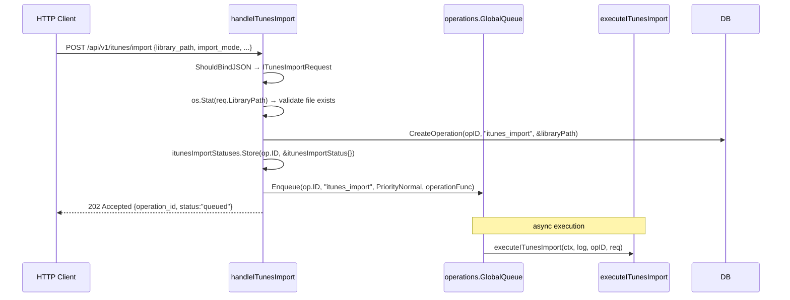
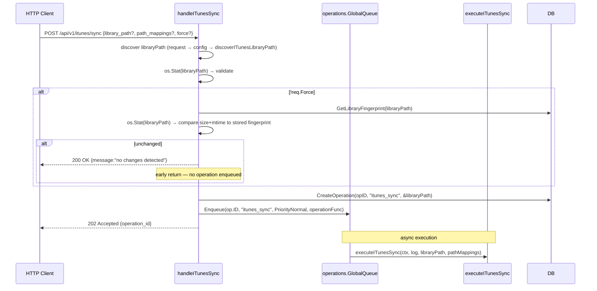
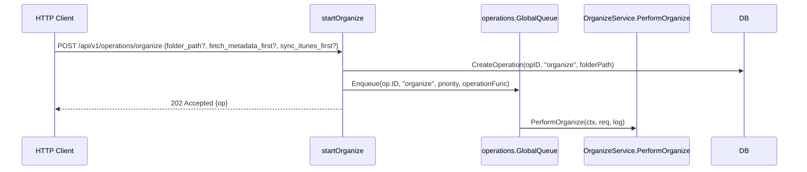
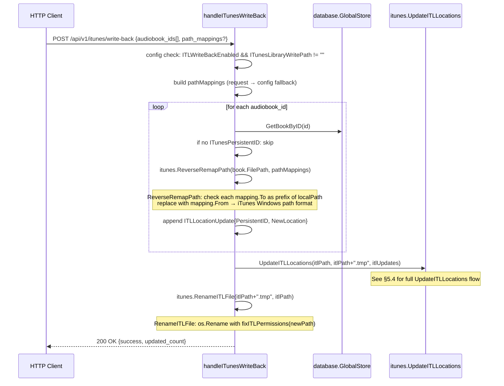
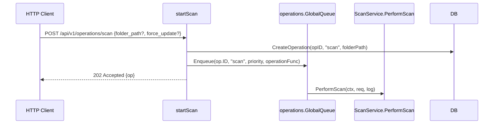
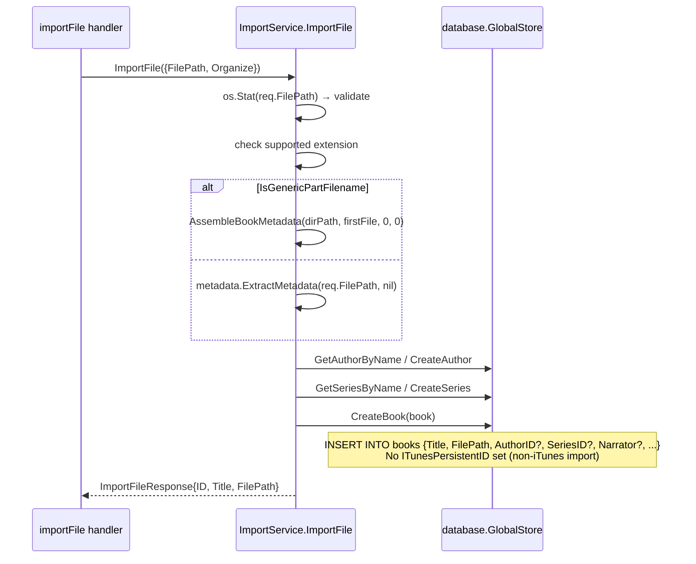
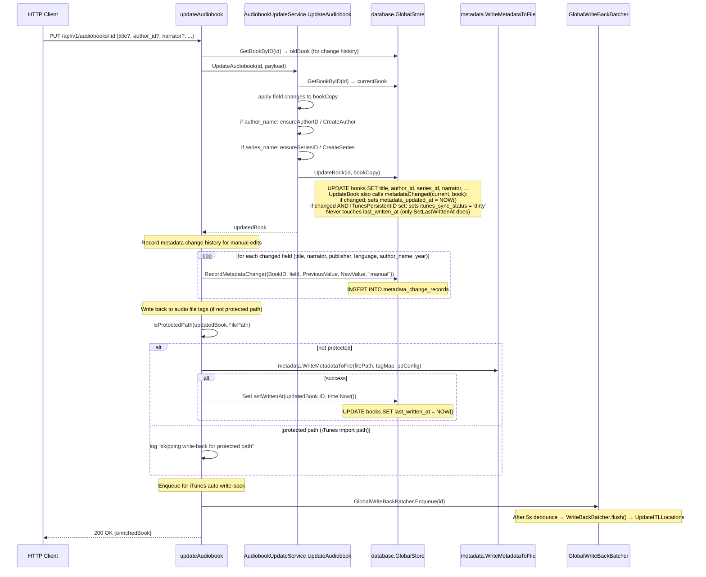

# iTunes Integration, Book Importing, and File Access — Complete Flow Diagrams

**File:** `docs/itunes-flow-diagrams.md`
**Version:** 1.0.0
**Date:** 2026-04-04

This document exhaustively traces every Go function call, DB table read/write, and decision point for the seven major code flows involving iTunes integration, book importing, and file access in the audiobook-organizer project.

---

## Table of Contents

1. [Architecture Overview](#1-architecture-overview)
2. [iTunes XML Sync](#2-itunes-xml-sync)
3. [iTunes ITL Sync](#3-itunes-itl-sync-binary-format)
4. [Organize Pipeline](#4-organize-pipeline)
5. [ITL Write-Back](#5-itl-write-back)
6. [Import from Filesystem](#6-import-from-filesystem)
7. [Book Metadata Update](#7-book-metadata-update)
8. [Merge / Dedup Operations](#8-merge--dedup-operations)
9. [Key Data Structures](#9-key-data-structures)
10. [DB Tables Reference](#10-db-tables-reference)
11. [Known Issues and Observations](#11-known-issues-and-observations)
12. [Essential Files Index](#12-essential-files-index)

---

## 1. Architecture Overview

```
HTTP Client
    │
    ▼
internal/server/server.go  (Gin router, route registration ~line 1536)
    │
    ├── internal/server/itunes.go           iTunes import/sync/write-back handlers
    ├── internal/server/organize_service.go  PerformOrganize
    ├── internal/server/scan_service.go     PerformScan (filesystem import)
    ├── internal/server/import_service.go   ImportFile (single-file import)
    ├── internal/server/audiobook_update_service.go  UpdateAudiobook
    ├── internal/server/metadata_fetch_service.go    ApplyMetadata / FetchMetadata
    └── internal/server/merge_service.go    MergeBooks / handleDedupBooks
             │
             ├── internal/itunes/            iTunes library parsing + ITL binary I/O
             │   ├── parser.go               XML plist dispatcher (ParseLibrary)
             │   ├── plist_parser.go         Apple plist XML parser (howett.net/plist)
             │   ├── itl.go                  ITL binary: hdfm header, AES-128/ECB decrypt,
             │   │                           zlib decompress, ParseITL, UpdateITLLocations
             │   ├── itl_be.go               Big-endian chunk walker (older iTunes)
             │   ├── itl_le.go               Little-endian chunk walker (iTunes v10+)
             │   ├── itl_convert.go          ParseITLAsLibrary (ITL → Library interface)
             │   ├── import.go               ImportOptions, ValidateImport, RemapPath
             │   ├── fingerprint.go          ComputeFingerprint (mtime+size+CRC32)
             │   └── library_watcher.go      fsnotify watcher for library file changes
             │
             ├── internal/organizer/organizer.go   OrganizeBook, OrganizeBookDirectory
             ├── internal/scanner/scanner.go       ScanDirectoryParallel, ProcessBooksParallel
             │                                     saveBookToDatabase, ComputeFileHash
             ├── internal/metadata/               tag extraction, metadata assembly
             └── internal/database/              Store interface, SQLite + PebbleDB backends
```

**Route registration** (`internal/server/server.go` ~line 1530):
```
POST /api/v1/itunes/validate            → handleITunesValidate
POST /api/v1/itunes/test-mapping        → handleITunesTestMapping
POST /api/v1/itunes/import              → handleITunesImport
POST /api/v1/itunes/write-back          → handleITunesWriteBack
POST /api/v1/itunes/write-back-all      → handleITunesWriteBackAll
POST /api/v1/itunes/write-back/preview  → handleITunesWriteBackPreview
GET  /api/v1/itunes/import-status/:id   → handleITunesImportStatus
POST /api/v1/itunes/import-status/bulk  → handleITunesImportStatusBulk
GET  /api/v1/itunes/library-status      → handleITunesLibraryStatus
POST /api/v1/itunes/sync                → handleITunesSync
POST /api/v1/operations/scan            → startScan
POST /api/v1/import/file                → importFile
PUT  /api/v1/audiobooks/:id             → updateAudiobook
POST /api/v1/audiobooks/:id/apply-metadata → applyAudiobookMetadata
POST /api/v1/operations/organize        → startOrganize
POST /api/v1/audiobooks/duplicates/dedup → handleDedupBooks
POST /api/v1/audiobooks/merge           → mergeBooks
```

---

## 2. iTunes XML Sync

### 2.1 Entry: `handleITunesImport`

**HTTP:** `POST /api/v1/itunes/import`

**File:** `internal/server/itunes.go:280`



### 2.2 `executeITunesImport` — Phase 1: Parsing and Grouping

**File:** `internal/server/itunes.go:828`

```mermaid
sequenceDiagram
    participant E as executeITunesImport
    participant P as itunes.ParseLibrary
    participant G as groupTracksByAlbum
    participant DB as database.GlobalStore

    E->>DB: operations.SaveParams(store, opID, ITunesImportParams{...})
    Note over DB: writes to operations table (params column)
    E->>DB: operations.LoadCheckpoint(store, opID) → resumeIndex
    E->>E: loadITunesImportStatus(opID) → status (sync.Map)
    E->>P: itunes.ParseLibrary(req.LibraryPath)
    P->>P: os.Open(path) → peek first 4 bytes
    alt magic == "hdfm"
        P->>P: ParseITLAsLibrary(path) → ITL binary path
    else XML plist
        P->>P: io.ReadAll → parsePlist(data)
        P->>P: howett.net/plist.Unmarshal → plistLibrary
        P->>P: convert plistLibrary → Library{Tracks, Playlists}
    end
    P-->>E: Library{Tracks map[string]*Track, Playlists}
    E->>G: groupTracksByAlbum(library)
    G->>G: for each Track: IsAudiobook(track) → filter
    G->>G: key = Artist+"|"+Album; sort by Disc+Track
    G-->>E: []albumGroup (ordered)
    E->>E: setITunesImportTotal(status, len(groups))
    E->>E: resolveITunesImportMode(req.ImportMode)
    Note over E: "organized" → ImportModeOrganized<br/>"organize" → ImportModeOrganize<br/>else → ImportModeImport
```

**DB tables written:** `operations` (SaveParams)

### 2.3 `executeITunesImport` — Phase 2: Per-Album Import Loop

**File:** `internal/server/itunes.go:890–1056`

```mermaid
sequenceDiagram
    participant E as executeITunesImport
    participant B as buildBookFromAlbumGroup
    participant A as assignAuthorAndSeries
    participant EID as ExternalIDStore
    participant DB as database.GlobalStore

    loop for each albumGroup
        E->>E: updateITunesProcessed(status, processed)
        E->>B: buildBookFromAlbumGroup(group, libraryPath, importOpts)
        B->>B: importOpts.RemapPath(firstTrack.Location)
        B->>B: itunes.DecodeLocation(remapped) → filePath
        B->>B: os.Stat(filePath) → validate exists
        B->>B: if multi-track: commonParentDir(tracks, opts) → bookFilePath
        B->>B: sum TotalTime + Size across tracks
        B-->>E: *database.Book {Title, FilePath, ITunesPersistentID, ...}

        E->>A: assignAuthorAndSeries(book, group.tracks[0])
        A->>A: ensureAuthorIDs(track.Artist) [SplitCompositeAuthorName → parts]
        A->>DB: GetAuthorByName(normalizedName)
        alt author not found
            A->>DB: CreateAuthor(name)
            Note over DB: INSERT INTO authors
        end
        A->>A: extractSeriesName(track.Album) → seriesName
        A->>DB: GetSeriesByName(seriesName, authorID)
        alt series not found
            A->>DB: CreateSeries(seriesName, authorID)
            Note over DB: INSERT INTO series
        end
        A-->>E: book.AuthorID, book.SeriesID, book.Authors[] set

        E->>EID: asExternalIDStore(store) [type assertion]
        EID->>EID: IsExternalIDTombstoned("itunes", firstPID)
        alt tombstoned
            E->>E: skip (continue)
        end
        EID->>EID: GetBookByExternalID("itunes", firstPID)
        alt PID already mapped
            E->>DB: GetBookByID(bookID)
            E->>E: linkITunesMetadata(existing, book, track, log)
            E->>DB: UpdateBook(existing.ID, existing)
            Note over DB: updates itunes_persistent_id, play_count,<br/>rating, bookmark, date_added, version_group_id
            E->>E: updateITunesLinked(status); continue
        end

        alt req.SkipDuplicates
            E->>DB: GetBookByFilePath(book.FilePath)
            alt path match found
                E->>E: linkITunesMetadata; continue
            end
        end

        E->>E: book.LibraryState = "imported" (or "organized" if ImportModeOrganized)
        E->>E: vgID = "vg-" + ulid; book.VersionGroupID = vgID
        E->>E: book.IsPrimaryVersion = false  (iTunes original is non-primary)
        E->>E: metadata.ExtractCoverArt(firstTrackPath) → coverPath
        E->>DB: CreateBook(book)
        Note over DB: INSERT INTO books<br/>Writes: title, file_path, format, duration,<br/>itunes_persistent_id, itunes_play_count,<br/>itunes_rating, itunes_bookmark,<br/>itunes_import_source, version_group_id,<br/>is_primary_version, library_state

        loop for each track in group (register PID mappings)
            EID->>DB: CreateExternalIDMapping({source:"itunes", externalID:PID, bookID, trackNumber, filePath})
            Note over DB: INSERT INTO external_id_map
        end

        alt len(group.tracks) > 1
            loop for each track
                E->>E: decode track path
                E->>DB: CreateBookFile({BookID, FilePath, ITunesPersistentID, Format, Duration, TrackNumber, ...})
                Note over DB: INSERT INTO book_files
            end
        end

        E->>DB: SetBookAuthors(created.ID, book.Authors)
        Note over DB: INSERT INTO book_authors

        alt req.ImportPlaylists
            E->>E: itunes.ExtractPlaylistTags(trackID, library.Playlists)
        end

        every 10 albums:
            E->>DB: operations.SaveCheckpoint(store, opID, "importing", i, total)
    end
```

**DB tables written:**
- `authors` (get-or-create)
- `series` (get-or-create)
- `books` (INSERT via CreateBook)
- `external_id_map` (INSERT mappings for each PID)
- `book_files` (INSERT for multi-track albums)
- `book_authors` (INSERT junction rows)
- `operations` (SaveCheckpoint every 10 albums)

### 2.4 `executeITunesImport` — Phase 3–5: Hash Validation, Enrichment, Organize

**File:** `internal/server/itunes.go:1062–1162`

```mermaid
sequenceDiagram
    participant E as executeITunesImport
    participant DB as database.GlobalStore
    participant MFS as MetadataFetchService
    participant ORG as organizer.Organizer

    Note over E: Phase 3 — Hash validation (if SkipDuplicates)
    loop for each newBookID
        E->>DB: GetBookByID(bookID)
        E->>E: scanner.ComputeFileHash(book.FilePath)
        E->>DB: IsHashBlocked(hash) → if blocked: UpdateBook (MarkedForDeletion=true)
        E->>DB: GetBookByFileHash(hash) → check for existing duplicate
        alt duplicate found, different VG
            E->>E: link to existing VG; book.IsPrimaryVersion=false
        end
        E->>DB: UpdateBook(book.ID, book) [save hash + VG changes]
    end

    Note over E: Phase 4 — Metadata enrichment (if req.FetchMetadata)
    E->>MFS: NewMetadataFetchService(database.GlobalStore)
    E->>E: enrichITunesImportedBooks(log, status)
    loop for each book where library_state=="imported" && itunes_import_source != nil
        MFS->>MFS: FetchMetadataForBook(book.ID)
        Note over MFS: queries OpenLibrary / Google Books
        MFS->>DB: UpdateBook / SetBookAuthors
        every 10 enrichments: sleep 2s (rate limiting)
    end

    Note over E: Phase 5 — Organize (if ImportModeOrganize && !PreserveLocation)
    E->>E: organizeImportedBooks(log, status)
    loop for each book where library_state=="imported" && itunes_import_source != nil
        E->>ORG: organizer.NewOrganizer(&config.AppConfig)
        ORG->>ORG: org.OrganizeBook(book) → (newPath, method, err)
        ORG->>ORG: generateTargetPath → expandPattern(FolderNamingPattern + FileNamingPattern)
        ORG->>ORG: reflinkFile / hardlinkFile / copyFile
        E->>E: book.FilePath = newPath; applyOrganizedFileMetadata(book, newPath)
        E->>DB: UpdateBook(book.ID, book) [library_state="organized"]
        alt UpdateBook fails
            E->>E: os.Rename(newPath → oldPath) [rollback]
        end
    end

    E->>DB: operations.ClearState(store, opID)
    E->>E: itunes.ComputeFingerprint(req.LibraryPath)
    E->>DB: store.SaveLibraryFingerprint(fp.Path, fp.Size, fp.ModTime, fp.CRC32)
    Note over DB: INSERT/UPDATE INTO library_fingerprints
```

**DB tables read/written:**
- `books` (UpdateBook — hash, VG, deletion, organized state)
- `library_fingerprints` (SaveLibraryFingerprint)
- `operations` (ClearState)

---

## 3. iTunes ITL Sync (Binary Format)

### 3.1 Entry: `handleITunesSync`

**HTTP:** `POST /api/v1/itunes/sync`

**File:** `internal/server/itunes.go:1881`

The sync handler and `executeITunesSync` both call `itunes.ParseLibrary()` — which auto-detects format. When the file starts with `"hdfm"` magic bytes, it routes to the ITL binary parser instead of the XML path.



Also triggered automatically by:
- **Scheduled sync** (`internal/server/server.go:2262`): `startITunesSyncScheduler` goroutine calls `triggerITunesSync()` at configured interval.
- **Before organize** (`internal/server/organize_service.go:184`): `syncITunesBeforeOrganize` calls `executeITunesSync` directly (no operation record).

### 3.2 ITL Binary Parsing — `ParseITL`

**File:** `internal/itunes/itl.go:492`

```mermaid
sequenceDiagram
    participant PL as ParseLibrary
    participant PI as ParseITL / parseITLData
    participant BE as walkChunksBE (itl_be.go)
    participant LE as walkChunksLE (itl_le.go)
    participant CV as ParseITLAsLibrary (itl_convert.go)

    PL->>PL: os.Open → io.ReadFull(4 bytes) → check magic
    alt magic == "hdfm"
        PL->>CV: ParseITLAsLibrary(path)
        CV->>PI: ParseITL(path)
        PI->>PI: os.ReadFile(path) → data
        PI->>PI: parseHdfmHeader(data)
        Note over PI: hdfm tag(4) + headerLen(4) + fileLen(4) + unknown(4)<br/>+ verLen(1) + version(N) + remainder<br/>maxCryptSize at offset 92
        PI->>PI: itlDecrypt(hdr, payload)
        Note over PI: AES-128/ECB, key="BHUILuilfghuila3"<br/>Only encrypts first maxCryptSize bytes (v10+: ≤102400)<br/>Decrypts block by block, 16 bytes at a time
        PI->>PI: itlInflate(decrypted)
        Note over PI: zlib detect: first byte == 0x78<br/>Cap at 512 MB to prevent decompression bombs
        PI->>PI: detectLE(decompressed) → check first 4 bytes == "msdh"
        alt LE format (v10+, msdh tag)
            PI->>LE: walkChunksLE(decompressed, lib)
            LE->>LE: walk msdh containers (blockType 0x01=tracks, 0x02=playlists)
            LE->>LE: walk mith blocks → parseMithLE (track fields at fixed offsets)
            Note over LE: TrackID @+16, Size @+36, TotalTime @+40,<br/>PlayCount @+76, Rating @+108, DateAdded @+120<br/>PID[8] @+128 stored LE → reverse bytes for BE hex
            LE->>LE: walk mhoh blocks → parseMhohLE (string metadata)
            Note over LE: hohmType 0x02=Name, 0x03=Album, 0x04=Artist<br/>0x05=Genre, 0x06=Kind, 0x0B=LocalURL, 0x0D=Location<br/>encodingFlag: 0=ASCII, 1=UTF-16BE, 2=UTF-8, 3=Win-1252
        else BE format (older iTunes, hdsm/htim/hohm tags)
            PI->>BE: walkChunksBE(decompressed, lib)
            BE->>BE: walk hdsm containers → walkHdsmContentBE
            BE->>BE: htim = track record (parseHtimBE)
            BE->>BE: hohm = string metadata per field
            BE->>BE: hpim = playlist, hptm = track-in-playlist
        end
        PI-->>CV: ITLLibrary{Tracks []ITLTrack, Playlists []ITLPlaylist}
        CV->>CV: for each ITLTrack: pidToHex(t.PersistentID) → uppercase hex
        Note over CV: LE parser already reversed bytes → straight hex = BE/XML format
        CV->>CV: track.Location = t.Location (hohm 0x0D); fallback t.LocalURL (0x0B)
        CV->>CV: t.LastPlayDate → track.PlayDate (Unix timestamp)
        CV-->>PL: Library{Tracks map[string]*Track, Playlists []*Playlist}
    else XML plist
        PL->>PL: parsePlist(data) via howett.net/plist.Unmarshal
    end
```

### 3.3 `executeITunesSync` — Incremental Update Loop

**File:** `internal/server/itunes.go:1975`

```mermaid
sequenceDiagram
    participant ES as executeITunesSync
    participant DB as database.GlobalStore
    participant P as itunes.ParseLibrary

    ES->>P: ParseLibrary(libraryPath) [XML or ITL auto-detect]
    ES->>ES: groupTracksByAlbum(library)

    Note over ES: Apply deferred iTunes updates (if ITL write-back enabled)
    ES->>DB: GetPendingDeferredITunesUpdates()
    Note over DB: SELECT FROM deferred_itunes_updates WHERE applied_at IS NULL
    alt pending > 0
        ES->>ES: itunes.UpdateITLLocations(itlPath, tmpPath, updates)
        ES->>ES: itunes.RenameITLFile(tmpPath, itlPath)
        loop for each applied update
            ES->>DB: MarkDeferredITunesUpdateApplied(p.ID)
        end
    end

    Note over ES: Build in-memory index to avoid O(n^2) scans
    ES->>DB: GetAllBooks(100000, 0) → allBooks
    ES->>ES: pidIndex[PID] = &book; pathIndex[path] = &book; titleIndex[lower(title)] = &book

    Note over ES: const itunesBatchFlushSize = 500
    Note over ES: pendingFiles = []*BookFile collected across groups

    loop for each albumGroup (i, group)
        ES->>ES: persistentID = firstTrack.PersistentID
        ES->>ES: existing = pidIndex[persistentID]
        alt existing == nil
            ES->>ES: fallback: titleIndex[lower(album)]
        end
        alt existing == nil
            ES->>ES: buildBookFromAlbumGroup → os.Stat check
            ES->>ES: pathIndex[book.FilePath] → path match
        end
        alt existing != nil, PID was missing
            ES->>ES: existing.ITunesPersistentID = persistentID  [backfill]
            ES->>ES: pidIndex[persistentID] = existing
        end

        alt existing != nil (UPDATE path)
            ES->>ES: compare PlayCount, Rating, Bookmark, LastPlayed, ITunesPath
            alt changed
                ES->>DB: UpdateBook(existing.ID, existing)
                Note over DB: UPDATE books SET itunes_play_count, itunes_rating,<br/>itunes_bookmark, itunes_last_played, itunes_path,<br/>updated_at, metadata_updated_at (if metadata fields changed)
                ES->>ES: itunesActivityRecorder(ActivityEntry{Type:"itunes_sync", ...})
            end
            loop for each track in group
                ES->>DB: GetBookFileByPID(track.PersistentID)
                alt no existing file OR itunes_path changed
                    ES->>ES: decode + remap track path
                    ES->>ES: remapWindowsPath(decodedPath, opts)  [last-resort Windows→Linux]
                    ES->>ES: pendingFiles append BookFile{ITunesPath, ITunesPersistentID, ...}
                end
            end
        else (NEW BOOK path)
            ES->>ES: buildBookFromAlbumGroup
            ES->>ES: assignAuthorAndSeries → DB: GetAuthorByName/CreateAuthor + GetSeriesByName/CreateSeries
            ES->>DB: CreateBook(book)
            Note over DB: INSERT INTO books with library_state="imported"
            ES->>DB: SetBookAuthors(created.ID, book.Authors)
            loop for each track
                ES->>ES: decode + remap path; pendingFiles append
            end
        end

        if len(pendingFiles) >= 500:
            ES->>DB: BatchUpsertBookFiles(pendingFiles)
            Note over DB: INSERT OR REPLACE INTO book_files (batch)
            ES->>ES: pendingFiles = pendingFiles[:0]
    end

    ES->>DB: BatchUpsertBookFiles(remaining pendingFiles)
    ES->>ES: itunes.ComputeFingerprint(libraryPath)
    ES->>DB: SaveLibraryFingerprint(path, size, modTime, crc32)
```

**DB tables read/written:**
- `deferred_itunes_updates` (read pending; mark applied)
- `books` (read all for index; UpdateBook for changed; CreateBook for new)
- `authors`, `series` (get-or-create for new books)
- `book_authors` (SetBookAuthors for new books)
- `book_files` (BatchUpsertBookFiles)
- `library_fingerprints` (SaveLibraryFingerprint)

### 3.4 ITL Binary Format Differences (BE vs LE)

| Aspect | BE (older iTunes, pre-v10) | LE (iTunes v10+, v10+ file) |
|---|---|---|
| First chunk tag | `hdsm` | `msdh` |
| Detected by | `detectLE` returns false | `detectLE(data)` returns true |
| Track container | `htim` (Big-endian uint32) | `mith` inside `miah` or flat under `msdh(0x01)` |
| String data | `hohm` with BE lengths | `mhoh` with LE lengths |
| Playlist | `hpim` / `hptm` | `miph` / `mtph` |
| PID bytes | Stored in natural BE order; `pidToHex()` | Stored reversed LE; `parseMithLE` reverses back; `pidToHexLE` does no extra reversal |
| Header lengths | `readUint32BE` | `readUint32LE`; `headerLen` and `totalLen` are separate; container tags use `totalLen` |

---

## 4. Organize Pipeline

### 4.1 Entry: `startOrganize`

**HTTP:** `POST /api/v1/operations/organize`

**File:** `internal/server/server.go:6112`



### 4.2 `PerformOrganize`

**File:** `internal/server/organize_service.go:64`

```mermaid
sequenceDiagram
    participant O as PerformOrganize
    participant S as syncITunesBeforeOrganize
    participant F as filterBooksNeedingOrganization
    participant OB as organizeBooks (worker pool)
    participant WB as writeBackITLLocations

    O->>O: if req.SyncITunesFirst: syncITunesBeforeOrganize(ctx, log)
    Note over S: discoverITunesLibraryPath() → executeITunesSync(ctx, log, path, nil)

    O->>O: autoBackup(log) → backup.CreateBackup(dbPath, dbType, backupConfig)

    loop paginate GetAllBooks(1000, offset) until empty page
        O->>DB: GetAllBooks(1000, offset)
    end
    Note over O: allBooks has all non-deleted books

    alt req.FetchMetadataFirst
        O->>O: NewMetadataFetchService(db)
        loop for each book without CoverURL
            O->>MFS: FetchMetadataForBook(book.ID)
        end
        O->>O: re-fetch allBooks (metadata may have changed)
    end

    O->>F: filterBooksNeedingOrganization(allBooks, log)
    F->>F: skip soft-deleted books (MarkedForDeletion=true)
    F->>F: skip non-primary versions that have a primary in their VG
    F->>F: if in RootDir: bookNeedsReOrganize → org.GenerateTargetPath vs book.FilePath
    F->>F: if outside RootDir: GetBookFiles → count active (non-missing) files
    F-->>O: booksToOrganize, alreadyCorrect

    O->>OB: organizeBooks(ctx, booksToOrganize, alreadyCorrect, log, opID)
    Note over OB: 8 worker goroutines; each owns full pipeline for one book

    O->>O: if stats.Organized > 0 || stats.ReOrganized > 0:
    O->>O:   collectITLUpdates(orgSvc.db) → parallel 4-worker page scan
    O->>O:   itunes.UpdateITLLocations(writePath, writePath+".tmp", itlUpdates)
    O->>O:   itunes.RenameITLFile(writePath+".tmp", writePath)
```

### 4.3 `organizeBooks` Worker Pool

**File:** `internal/server/organize_service.go:400`

```mermaid
sequenceDiagram
    participant W as Worker goroutine
    participant RIP as reOrganizeInPlace
    participant ODB as organizeDirectoryBook
    participant ORG as organizer.OrganizeBook
    participant COV as createOrganizedVersion
    participant DB as database.GlobalStore

    Note over W: per-book dispatch based on location
    alt alreadyInRoot (path starts with config.AppConfig.RootDir)
        W->>RIP: reOrganizeInPlace(&book, log)
        RIP->>ORG: org.GenerateTargetPath(book) or GenerateTargetDirPath
        RIP->>RIP: os.Rename(oldPath, targetPath) [in-place move]
        RIP->>DB: UpdateBook(book.ID, book) [new FilePath]
        alt isDir
            RIP->>DB: GetBookFiles(book.ID)
            loop for each BookFile
                RIP->>RIP: bf.FilePath = filepath.Join(newPath, filename)
                RIP->>RIP: bf.ITunesPath = computeITunesPath(bf.FilePath)
                RIP->>DB: UpdateBookFile(bf.ID, &bf)
            end
        end
        RIP->>RIP: cleanupEmptyParents(oldDir, RootDir)
    else if isDir (multi-file book, file_path is directory)
        W->>ODB: organizeDirectoryBook(workerOrg, &book, log)
        ODB->>DB: GetBookFiles(book.ID) [mandatory — no directory scan fallback]
        ODB->>ODB: collect active (non-missing) segmentPaths
        ODB->>ORG: org.OrganizeBookDirectory(book, segmentPaths)
        ORG->>ORG: expandPattern(FolderNamingPattern, book) → targetDir
        ORG->>ORG: os.MkdirAll(targetDir, 0755)
        loop for each segmentPath
            ORG->>ORG: organizeFile(srcPath, dstPath)
            Note over ORG: strategy "auto": reflinkFile → hardlinkFile → copyFile<br/>"copy": copyFile<br/>"hardlink": os.Link<br/>"reflink": platform-specific ioctl<br/>"symlink": os.Symlink
        end
        ORG-->>ODB: (targetDir, pathMap{src→dst})
        ODB->>ODB: verify copiedCount > 0
        ODB-->>W: targetDir
    else single-file book outside RootDir
        W->>ORG: workerOrg.OrganizeBook(&book)
        ORG->>ORG: generateTargetPath → expandPattern
        ORG->>ORG: if hash exists: check DB for duplicate organized copy
        ORG->>ORG: organizeFile (strategy cascade)
        ORG-->>W: (newPath, method, err)
    end

    alt err != nil
        W->>DB: CreateOperationChange({organize_failed})
        W->>W: stats.Failed++
    else oldPath == newPath
        W->>DB: UpdateBook(book.ID, &book) [stamp LastOrganizedAt, LastOrganizeOperationID]
        W->>DB: CreateOperationChange({organize_skipped})
        W->>W: stats.AlreadyCorrect++
    else alreadyInRoot (successful rename)
        W->>DB: UpdateBook(book.ID, &book) [stamp LastOrganizedAt]
        W->>DB: CreateOperationChange({organize_rename})
        W->>W: stats.ReOrganized++
    else new organized copy
        W->>COV: createOrganizedVersion(workerOrg, &book, newPath, isDir, opID, log)
```

### 4.4 `createOrganizedVersion`

**File:** `internal/server/organize_service.go:652`

```mermaid
sequenceDiagram
    participant COV as createOrganizedVersion
    participant DB as database.GlobalStore

    Note over COV: Creates a NEW book record for the organized copy
    Note over COV: newBookID = ulid.Make()
    Note over COV: isPrimary = true; organizedState = "organized"

    COV->>COV: determine versionGroupID (reuse existing or generate)
    COV->>COV: newBook = copy of original metadata + newPath + organizedState + isPrimary=true

    alt !isDir (single file)
        COV->>COV: applyOrganizedFileMetadata(&newBook, newPath)
        Note over COV: scanner.ComputeFileHash(newPath) → FileHash, OrganizedFileHash<br/>os.Stat(newPath) → FileSize
    end

    COV->>DB: CreateBook(&newBook)
    Note over DB: INSERT INTO books (organized copy, is_primary_version=true, library_state="organized")

    COV->>DB: MarkNeedsRescan(createdBook.ID)
    COV->>DB: MarkNeedsRescan(book.ID)
    Note over DB: UPDATE books SET needs_rescan=true

    COV->>DB: GetBookAuthors(book.ID)
    COV->>DB: SetBookAuthors(newBookID, newAuthors)
    Note over DB: INSERT INTO book_authors for the new book

    COV->>DB: GetBookFiles(book.ID) → original book files
    loop for each BookFile
        COV->>COV: newBF.ID = ulid.Make()
        COV->>COV: newBF.BookID = newBookID
        alt isDir
            COV->>COV: newBF.FilePath = filepath.Join(newPath, filename)
        else
            COV->>COV: newBF.FilePath = newPath
        end
        COV->>COV: newBF.ITunesPath = computeITunesPath(newBF.FilePath)
        Note over COV: computeITunesPath: reverse-maps local path → iTunes Windows path<br/>using config.AppConfig.ITunesPathMappings<br/>format: "file://localhost/W:/itunes/..."
        COV->>DB: CreateBookFile(&newBF)
        Note over DB: INSERT INTO book_files (organized copy's files with recomputed itunes_path)
    end

    Note over COV: Update ORIGINAL book
    COV->>COV: book.VersionGroupID = versionGroupID
    COV->>COV: book.IsPrimaryVersion = false  (original loses primary status)
    COV->>COV: book.LibraryState = "organized_source"
    COV->>DB: UpdateBook(book.ID, book)
    Note over DB: UPDATE books SET version_group_id, is_primary_version=false, library_state="organized_source"

    COV->>DB: CreateOperationChange({book_create, "version_of:originalID path:newPath"})
    COV->>DB: CreateOperationChange({metadata_update, "version_group_id", "", versionGroupID})
    COV-->>COV: createdBook (organized primary)
```

**DB tables written:**
- `books` (CreateBook for organized copy; UpdateBook original; MarkNeedsRescan both)
- `book_authors` (SetBookAuthors for new book)
- `book_files` (CreateBookFile — new files with recomputed `itunes_path`)
- `operation_changes` (two records)

---

## 5. ITL Write-Back

### 5.1 Entry Options

There are four paths that trigger ITL write-back:

| Path | Function | Trigger |
|---|---|---|
| Manual per-book | `handleITunesWriteBack` | `POST /api/v1/itunes/write-back` |
| Manual bulk | `handleITunesWriteBackAll` | `POST /api/v1/itunes/write-back-all` |
| Auto after organize | `organizeBooks` end + `PerformOrganize` end | After `organizeBooks` worker pool completes |
| Auto after metadata update | `WriteBackBatcher.flush()` | Debounced 5s after any book update (if `ITunesAutoWriteBack=true`) |

### 5.2 `handleITunesWriteBack` (Manual Per-Book)

**File:** `internal/server/itunes.go:329`



### 5.3 `collectITLUpdates` — Building the Update Set

**File:** `internal/server/itunes.go:417`

Used by `handleITunesWriteBackAll` and `PerformOrganize`.

```mermaid
sequenceDiagram
    participant C as collectITLUpdates
    participant DB as database.GlobalStore

    Note over C: 4 parallel workers; page size 10000
    C->>C: pageCh = channel of offsets (0, 10000, 20000, ...)
    Note over C: Each worker reads from pageCh until GetAllBooks returns empty page

    loop for each page of books
        C->>DB: GetAllBooks(10000, offset)
        loop for each book
            C->>C: if !IsPrimaryVersion: skip  [avoid duplicate PIDs]
            C->>DB: GetBookFiles(book.ID)
            alt has book_files
                loop for each BookFile
                    C->>C: if f.ITunesPersistentID != "" && f.ITunesPath != "":
                    C->>C:   append ITLLocationUpdate{PID: f.ITunesPersistentID, NewLocation: f.ITunesPath}
                end
            else no book_files
                C->>C: if book.ITunesPersistentID != "" && book.ITunesPath != "":
                C->>C:   append ITLLocationUpdate{PID, NewLocation: *book.ITunesPath}
            end
        end
    end
    C-->>caller: []ITLLocationUpdate
```

**Important:** Uses `book_files.itunes_path` (the recomputed `file://localhost/W:/...` URL) not `book.file_path`. This is set by `computeITunesPath()` during `createOrganizedVersion`.

### 5.4 `UpdateITLLocations` — Binary Rewrite

**File:** `internal/itunes/itl.go:662`

```mermaid
sequenceDiagram
    participant U as UpdateITLLocations
    participant BE as rewriteChunksBE (itl_be.go)
    participant LE as rewriteChunksLE (itl_le.go)

    U->>U: build updateMap[lower(PID)] = NewLocation
    U->>U: os.ReadFile(inputPath)
    U->>U: parseHdfmHeader(data) → hdr
    U->>U: itlDecrypt(hdr, payload)
    U->>U: itlInflate(decrypted) → (decompressed, wasCompressed)
    U->>U: detectLE(decompressed)
    alt LE format
        U->>LE: rewriteChunksLE(decompressed, updateMap)
        LE->>LE: walk msdh containers
        LE->>LE: for each msdh(blockType=0x01):
        LE->>LE:   rewriteMsdhContentLE → walk miah/mith/mhoh
        LE->>LE:   parseMithLE to get currentPID
        LE->>LE:   for each mhoh(type=0x0D location or 0x0B localURL):
        LE->>LE:     shouldUpdateMhohLE: check PID in updateMap → newLoc
        LE->>LE:     rewriteHohmLocationLE(data, offset, length, newLoc)
        Note over LE: Preserve origHeaderLen (fixed, e.g. 24)<br/>Set new totalLen = 40 + len(encodedStr)<br/>Update miah.totalLen and msdh.totalLen
        LE-->>U: (newData, updatedCount)
    else BE format
        U->>BE: rewriteChunksBE(decompressed, updateMap)
        Note over BE: Similar walk: htim → currentPID; hohm(0x0D/0x0B) → rewrite
    end
    U->>U: if wasCompressed: itlDeflate(newData) [zlib BestSpeed]
    U->>U: itlEncrypt(hdr, finalPayload)
    U->>U: buildHdfmHeader(version, remainder, newFileLen, unknown)
    U->>U: outData = header + encrypted
    U->>U: os.WriteFile(outputPath, outData, 0666)
    U->>U: fixITLPermissions(outputPath) [os.Chmod 0644]
    U-->>caller: ITLWriteBackResult{UpdatedCount, OutputPath}
```

### 5.5 `WriteBackBatcher` — Auto Write-Back After Metadata Update

**File:** `internal/server/itunes_writeback_batcher.go:44`

```
Trigger points (all call GlobalWriteBackBatcher.Enqueue(bookID)):
  - updateAudiobook (server.go:3373) — after PUT /audiobooks/:id
  - batchUpdateAudiobooks (server.go:3413) — after PUT /audiobooks/batch
  - applyAudiobookMetadata (server.go:7333) — after POST /audiobooks/:id/apply-metadata
  - undoLastApply (server.go:3068) — after POST /audiobooks/:id/undo
  - fetchAudiobookMetadata (server.go:7272) — after POST /audiobooks/:id/fetch-metadata
```

```mermaid
sequenceDiagram
    participant E as Enqueue(bookID)
    participant B as WriteBackBatcher
    participant F as flush()

    E->>B: if !config.ITunesAutoWriteBack: return (no-op)
    B->>B: pending[bookID] = true
    B->>B: timer.Stop(); timer = time.AfterFunc(5s, flush)
    Note over B: additional calls within 5s reset the timer

    B->>F: flush() [after 5s debounce]
    F->>F: collect all pending IDs; pending = {}
    loop for each bookID
        F->>DB: GetBookByID(id)
        F->>DB: GetBookFiles(id)
        alt has book_files with ITunesPersistentID + ITunesPath
            F->>F: append ITLLocationUpdate per file
        else no book_files
            F->>F: use book.ITunesPersistentID + book.ITunesPath
        end
    end
    F->>F: itunes.UpdateITLLocations(itlPath, itlPath+".tmp", itlUpdates)
    F->>F: os.Rename(itlPath+".tmp", itlPath) [via renameFile hook]
```

### 5.6 `deferred_itunes_updates` Table

**Migration 33** added `deferred_itunes_updates` for cases where ITL write-back was disabled at transcode/organize time but the path changed. The table is only consumed — not written to by the primary flows above — during `executeITunesSync` (§3.3). The write path (`CreateDeferredITunesUpdate`) is called in `server.go:6300` during transcode operations when `ITLWriteBackEnabled=false`.

---

## 6. Import from Filesystem

### 6.1 Entry: `startScan`

**HTTP:** `POST /api/v1/operations/scan`

**File:** `internal/server/server.go:6062`



### 6.2 `ScanService.PerformScan`

**File:** `internal/server/scan_service.go:57`

```mermaid
sequenceDiagram
    participant SS as PerformScan
    participant DB as database.GlobalStore
    participant SC as scanner.ScanDirectoryParallel
    participant PB as scanner.ProcessBooksParallel
    participant AO as autoOrganizeScannedBooks

    SS->>SS: determineFoldersToScan(req.FolderPath, forceUpdate)
    alt specific folder provided
        SS->>SS: foldersToScan = [folderPath]
    else full scan
        SS->>DB: GetAllImportPaths() → enabled paths
        SS->>SS: if forceUpdate: prepend config.RootDir
    end

    alt !forceUpdate
        SS->>DB: GetScanCacheMap() → map[filePath]ScanCacheEntry{Mtime, Size, NeedsRescan}
        SS->>DB: GetDirtyBookFolders() → folders with needs_rescan=true
        SS->>SS: add dirty folders to scan list
    end

    SS->>SC: scanner.SetScanCache(scanCache) [package-level]
    defer: scanner.ClearScanCache()

    loop for each folderPath
        SS->>SC: ScanDirectoryParallel(folderPath, workers, log)
        Note over SC: filepath.Walk → collect dirs; parallel per-dir reads<br/>groupFilesIntoBooks(audioFiles) → by album tag
        SC-->>SS: []scanner.Book{FilePath, Title, Author, ...}

        SS->>PB: ProcessBooksParallel(ctx, books, workers, progressCallback, log)
        Note over PB: Per-book: shouldSkipFile (mtime+size cache check)
        Note over PB: if IsGenericPartFilename: AssembleBookMetadata from dir
        Note over PB: else: ProcessFile(filePath) → metadata.ExtractMetadata + hash
        Note over PB: fallback: extractInfoFromPath (parse author/title from path)
        Note over PB: saveBook(&books[idx]) → saveBookToDatabase
        Note over PB: createBookFilesForBook(dirPath, nil, log) for dir-based books

        SS->>AO: autoOrganizeScannedBooks(ctx, books, log)
        alt config.AutoOrganize && config.RootDir != ""
            loop for each book
                AO->>DB: GetBookByFilePath(books[i].FilePath)
                AO->>ORG: org.OrganizeBook(dbBook)
                alt newPath != dbBook.FilePath
                    AO->>AO: applyOrganizedFileMetadata(dbBook, newPath)
                    AO->>DB: UpdateBook(dbBook.ID, dbBook)
                end
            end
        end

        SS->>SS: updateImportPathBookCount(folderPath, len(books))
    end
```

### 6.3 `saveBookToDatabase`

**File:** `internal/scanner/scanner.go:1307`

This is the core upsert function for all scanned books. No iTunes PID is assigned here.

```mermaid
sequenceDiagram
    participant S as saveBookToDatabase
    participant DB as database.GlobalStore

    S->>S: resolveAuthorID(book.Author) → GetAuthorByName / CreateAuthor
    S->>S: resolveSeriesID(book.Series, authorID) → GetSeriesByName / CreateSeries
    S->>S: GetAllWorks() → find or CreateWork
    S->>S: ComputeFileHash(book.FilePath) or reuse precomputed hash
    S->>DB: IsHashBlocked(hash) → if blocked: return nil (skip)

    Note over S: Upsert semantics — check by filePath first
    S->>DB: GetBookByFilePath(book.FilePath) → existing
    alt not found by path, have hash
        S->>DB: GetBookByFileHash(hash) → candidate
        S->>DB: GetBookByOriginalHash(hash) → candidate
        S->>DB: GetBookByOrganizedHash(hash) → candidate
        alt candidate found, not already version-linked
            S->>S: compute groupID = sha256(existing.FilePath + "|" + book.FilePath)[:8]
            S->>DB: UpdateBook(existing.ID, ...) [set VersionGroupID on existing]
            S->>S: dbBook.VersionGroupID = groupID; IsPrimaryVersion = false
            Note over S: fall through to CreateBook (both copies in VG)
        end
    end

    alt existing == nil (no path or hash match)
        S->>DB: GetBooksByTitleInDir(lower(title), parentDir)
        Note over DB: format-aware version link check
        S->>DB: CreateBook(dbBook)
        Note over DB: INSERT INTO books {Title, AuthorID, SeriesID, FilePath,<br/>Format, FileHash, FileSize, LibraryState="imported",<br/>VersionGroupID?, IsPrimaryVersion?}
        alt book.BookOrganizerID != "" (embedded AUDIOBOOK_ORGANIZER_ID tag)
            S->>DB: GetBookByID(book.BookOrganizerID)
            alt found and path differs
                S->>DB: UpdateBook(existingByOrgID.ID, ...) [update FilePath — book was moved]
            end
        end
    else existing found (UPDATE path)
        S->>S: preserveExistingFields(dbBook, existing)
        S->>DB: UpdateBook(existing.ID, existing) [update path, hash, size]
    end
```

### 6.4 `importFile` — Single File Import

**HTTP:** `POST /api/v1/import/file`

**File:** `internal/server/server.go:6612`, `internal/server/import_service.go:37`



---

## 7. Book Metadata Update

### 7.1 Manual Edit via API

**HTTP:** `PUT /api/v1/audiobooks/:id`

**File:** `internal/server/server.go:3215`



### 7.2 `metadataChanged()` — What Triggers `metadata_updated_at` and `itunes_sync_status`

**File:** `internal/database/sqlite_store.go:2407`

```
metadataChanged(old, new *Book) returns true if ANY of these differ:
  Title, AuthorID, SeriesID, SeriesSequence, Narrator, Publisher, Language,
  AudiobookReleaseYear, PrintYear, ISBN10, ISBN13, CoverURL, NarratorsJSON

Does NOT trigger on:
  FileHash, LibraryState, ITunesPersistentID, ITunesPlayCount, ITunesRating,
  ITunesBookmark, ITunesLastPlayed, ITunesPath, ITunesImportSource,
  FilePath, FileSize, Format, LastOrganizedAt, VersionGroupID, IsPrimaryVersion
```

When `metadataChanged` returns true AND the book has `ITunesPersistentID`:
- `itunes_sync_status` is set to `"dirty"`

When only system fields change (e.g., hash, path):
- `metadata_updated_at` is preserved from previous value
- `itunes_sync_status` is also preserved

### 7.3 Metadata Fetch (OpenLibrary / Google Books / AI)

**HTTP:** `POST /api/v1/audiobooks/:id/fetch-metadata`

**File:** `internal/server/server.go:7257` → `MetadataFetchService.FetchMetadataForBook`

```mermaid
sequenceDiagram
    participant C as HTTP Client
    participant H as fetchAudiobookMetadata
    participant MFS as MetadataFetchService
    participant DB as database.GlobalStore
    participant WB as GlobalWriteBackBatcher

    C->>H: POST /api/v1/audiobooks/:id/fetch-metadata
    H->>MFS: FetchMetadataForBook(id)
    MFS->>DB: GetBookByID(id)
    MFS->>MFS: query OpenLibrary, Google Books, Audnexus, etc.
    MFS->>MFS: select best candidate
    MFS->>DB: UpdateBook(id, book) [apply fetched metadata]
    Note over DB: sets metadata_updated_at if user-visible fields changed<br/>sets itunes_sync_status='dirty' if has PID
    MFS-->>H: FetchMetadataResponse{Book, Source}
    H->>WB: GlobalWriteBackBatcher.Enqueue(id)
    H-->>C: 200 OK
```

### 7.4 Apply Metadata Candidate

**HTTP:** `POST /api/v1/audiobooks/:id/apply-metadata`

**File:** `internal/server/server.go:7311` → `MetadataFetchService.ApplyMetadataCandidate`

After applying, calls `mfs.runApplyPipeline(id, updatedBook)` which:
1. Checks `isProtectedPath(book.FilePath)` — uses library copy if protected
2. Gets `book_files` for the book
3. Calls `ComputeTargetPaths(RootDir, pathFormat, segTitleFormat, book, bookFiles, vars)`
4. If `config.AutoRenameOnApply`: calls `RenameFiles(entries)` → renames audio files + updates `book_files.file_path` and `book_files.itunes_path`
5. Writes tags to audio files via `metadata.WriteTagsToFile`
6. Calls `database.GlobalStore.SetLastWrittenAt(id, time.Now())`

### 7.5 `last_written_at` vs `metadata_updated_at`

| Field | Set By | Meaning |
|---|---|---|
| `metadata_updated_at` | `UpdateBook` (auto, via `metadataChanged`) | Last time a user-visible metadata field changed in DB |
| `last_written_at` | `SetLastWrittenAt` only (explicit call) | Last time tags were physically written to the audio file |
| `itunes_sync_status` | `UpdateBook` (auto, 'dirty' if PID + metadata changed) | Tracks whether iTunes needs a write-back |
| `updated_at` | `UpdateBook` (always) | Tracks every DB write including system fields |

---

## 8. Merge / Dedup Operations

### 8.1 `handleDedupBooks` — Automated Deduplication

**HTTP:** `POST /api/v1/audiobooks/duplicates/dedup?dry_run=true`

**File:** `internal/server/maintenance_fixups.go:2115`

```mermaid
flowchart TD
    A[handleDedupBooks] --> B[fetchAllBooksPaginated]
    B --> C{Phase 1: Junk Records}
    C --> D[isJunkReadByNarrator: title contains 'read by' pattern with no useful metadata]
    D --> E[softDeleteBook: UPDATE books SET marked_for_deletion=true]
    E --> F{Phase 2: Same file_path}
    F --> G[pathGroups map: file_path → []Book]
    G --> H[for each group len≥2: pickKeeperIdx]
    H --> I[mergeDuplicateBook: mergeBookFields keeper←dup + softDeleteBook dup]
    I --> J{Phase 3: Same title+author+dir}
    J --> K[normalizeDedupTitle + authorID + filepath.Dir → key]
    K --> L[for each group len≥2: mergeDuplicateBook]
    L --> M{Phase 4: Version group duplicates}
    M --> N[vgGroups: vgID → []Book]
    N --> O[unlink duplicate VG entries: set VersionGroupID=nil, IsPrimaryVersion=nil]
```

**`mergeDuplicateBook`** (`maintenance_fixups.go:2530`):
1. `mergeBookFields(keeper, dup)` — copies non-nil fields from dup to keeper (never overwrites)
2. Special: `ITunesPersistentID`, `ITunesPlayCount`, `ITunesRating`, etc. are transferred if keeper lacks them
3. `UpdateBook(keeper.ID, current)` — save merged keeper
4. `softDeleteBook(store, dup.ID)` — `UPDATE books SET marked_for_deletion=true`

**`itunes_persistent_id` handling during dedup:** `mergeBookFields` copies `ITunesPersistentID` from `src` to `dst` only when `dst.ITunesPersistentID == nil`. This preserves the iTunes association on whichever copy had it.

### 8.2 `mergeBooks` (Manual Merge)

**HTTP:** `POST /api/v1/audiobooks/merge {keep_id, merge_ids[]}`

**File:** `internal/server/server.go:4648`

```mermaid
sequenceDiagram
    participant C as HTTP Client
    participant H as mergeBooks
    participant Q as operations.GlobalQueue
    participant DB as database.GlobalStore
    participant EID as ExternalIDStore

    C->>H: POST /api/v1/audiobooks/merge {keep_id, merge_ids[]}
    H->>DB: GetBookByID(req.KeepID) → keepBook
    H->>DB: CreateOperation(opID, "book-merge", detail)
    H->>Q: Enqueue(op.ID, "book-merge", operationFunc)
    H-->>C: 202 Accepted {op}

    Note over Q: async execution
    loop for each mergeID
        Q->>DB: GetBookByID(mergeID) → mergeBook
        Q->>Q: if kBook.ITunesPersistentID == nil && mergeBook has PID: copy PID
        Q->>Q: if kBook.ITunesPlayCount == nil: copy
        Q->>Q: if kBook.ITunesRating == nil: copy
        Q->>Q: if kBook.ITunesDateAdded == nil: copy
        Q->>Q: if kBook.ITunesLastPlayed == nil: copy
        Q->>Q: if kBook.ITunesBookmark == nil: copy
        Q->>DB: DeleteBook(mergeID)
        Note over DB: hard delete (not soft delete)
        Q->>DB: CreateOperationChange({book_delete, "merged_into:keepID"})
    end
    Q->>DB: UpdateBook(kBook.ID, kBook) [save transferred iTunes fields]
    Q->>EID: ReassignExternalIDs(mergeID, keepID) [for each merged book]
    Note over EID: UPDATE external_id_map SET book_id = keepID WHERE book_id = mergeID
```

### 8.3 `MergeService.MergeBooks` (Version Group Merge)

**HTTP:** via `mergeBookDuplicatesAsVersions` and similar endpoints

**File:** `internal/server/merge_service.go:34`

```mermaid
sequenceDiagram
    participant MS as MergeService.MergeBooks
    participant DB as database.GlobalStore
    participant EID as ExternalIDStore

    MS->>MS: fetch all books by ID
    MS->>MS: determine bestIdx (auto: M4B > highest bitrate > largest file; or explicit primaryID)
    MS->>MS: determine versionGroupID (reuse from any book already in a VG, else new ULID)

    loop for each book
        MS->>MS: book.VersionGroupID = versionGroupID
        MS->>MS: book.IsPrimaryVersion = (i == bestIdx)
        MS->>DB: UpdateBook(book.ID, book)
        Note over DB: Sets version_group_id and is_primary_version on ALL books
    end

    loop for each non-primary book
        MS->>EID: ReassignExternalIDs(book.ID, resolvedPrimaryID)
        Note over EID: Moves iTunes PID mappings to the primary book
    end
    MS-->>caller: MergeResult{PrimaryID, VersionGroupID, MergedCount}
```

**Version group semantics:**
- All books in a VG share the same `version_group_id`
- Exactly one has `is_primary_version=true` — the organized copy (highest quality)
- The iTunes original has `is_primary_version=false`, `library_state="organized_source"`
- `collectITLUpdates` only uses primary versions to avoid duplicate PIDs in ITL updates

---

## 9. Key Data Structures

### 9.1 `database.Book` — iTunes Fields

```go
// internal/database/store.go:419–431
ITunesPersistentID *string   // hex PID, e.g. "A1B2C3D4E5F60708"
ITunesPlayCount    *int      // cumulative play count from iTunes
ITunesRating       *int      // 0–100 scale (20=1star, 40=2stars, ..., 100=5stars)
ITunesBookmark     *int64    // playback position in milliseconds
ITunesDateAdded    *time.Time
ITunesLastPlayed   *time.Time
ITunesImportSource *string   // path to iTunes Library.xml that created this book
ITunesPath         *string   // raw "file://localhost/..." URL from iTunes XML
ITunesSyncStatus   *string   // "dirty" | "synced" | nil
MetadataUpdatedAt  *time.Time // when user-visible fields last changed
LastWrittenAt      *time.Time // when tags were last written to file
```

### 9.2 `database.BookFile` — Per-Track iTunes Fields

```go
// internal/database/store.go:642
ITunesPath         string  // raw "file://localhost/..." URL from iTunes for this track
ITunesPersistentID string  // per-track persistent ID
TrackNumber        int
TrackCount         int
DiscNumber, DiscCount int
```

### 9.3 `itunes.PathMapping`

```go
// internal/itunes/import.go:38
PathMapping struct {
    From string  // iTunes path prefix, e.g. "W:/itunes/iTunes Media"
    To   string  // local Linux path, e.g. "/mnt/bigdata/books/itunes/iTunes Media"
}
```

Used in:
- `ImportOptions.RemapPath(p string) string` — forward map (import/sync)
- `ReverseRemapPath(localPath string, mappings []PathMapping) string` — reverse map (write-back preview)
- `computeITunesPath(localPath string) string` — recomputes `itunes_path` column for organized copies

---

## 10. DB Tables Reference

### Tables Written Per Flow

| Table | Import | Sync | Organize | Write-Back | Scan | Manual Update | Merge/Dedup |
|---|---|---|---|---|---|---|---|
| `books` | CREATE + UPDATE | CREATE + UPDATE | CREATE + UPDATE | — | CREATE + UPDATE | UPDATE | UPDATE + soft-delete |
| `book_files` | CREATE | BATCH UPSERT | CREATE (organized copy) | — | CREATE (dir books) | UPDATE (paths) | — |
| `authors` | get-or-create | get-or-create | — | — | get-or-create | get-or-create | — |
| `series` | get-or-create | get-or-create | — | — | get-or-create | — | — |
| `book_authors` | INSERT | INSERT (new) | COPY from original | — | — | — | — |
| `external_id_map` | INSERT per PID | — | — | — | — | — | REASSIGN |
| `operations` | SaveParams + Checkpoint | — | SaveParams | — | SaveParams | — | CreateOperation |
| `operation_changes` | — | — | CREATE (per book) | — | — | — | CREATE |
| `metadata_change_records` | — | — | — | — | — | CREATE (per field) | — |
| `library_fingerprints` | SAVE | SAVE | — | — | — | — | — |
| `deferred_itunes_updates` | — | READ + MARK APPLIED | — | — | — | — | — |
| `book_path_history` | — | — | via RecordPathChange | — | — | via RecordPathChange | — |

### `itunes_sync_status` Lifecycle

```
NULL → (import/scan, no PID) → stays NULL
NULL → (import with PID) → stays NULL initially
"synced" → (UpdateBook, metadataChanged=true, PID set) → "dirty"
"dirty" → (executeITunesSync or write-back runs) → "synced" (via MarkITunesSynced)
```

Migration 41 backfills `itunes_sync_status = 'synced'` for all existing books that have `itunes_persistent_id`.

---

## 11. Known Issues and Observations

### 11.1 `itunes_path` Recomputation Required After Organize

`computeITunesPath()` (`internal/server/metadata_fetch_service.go:2755`) is called in `createOrganizedVersion` to rewrite the `book_files.itunes_path` column. This is necessary because the organized copy is now at a Linux path like `/mnt/bigdata/books/audiobook-organizer/Author/Book.m4b` but iTunes still expects `file://localhost/W:/audiobook-organizer/Author/Book.m4b`.

The function applies path mappings in **reverse** (local→iTunes). If mappings are not configured, `computeITunesPath` returns `""` — meaning ITL write-back will skip those files.

**Known issue:** `handleRecomputeITunesPaths` (`maintenance_fixups.go:3385`) exists as a maintenance endpoint to fix stale `itunes_path` values on `book_files`, but it is only exposed via `POST /api/v1/maintenance/recompute-itunes-paths`.

### 11.2 `IsPrimaryVersion=false` for iTunes Originals

During `executeITunesImport`, new books get `IsPrimaryVersion=false`. The rationale (comment at `itunes.go:961`) is that the iTunes original is considered non-primary; the organized copy will become primary. However, if organize is never run, the iTunes book stays as a non-primary with no primary in the VG. `filterBooksNeedingOrganization` handles this: if a non-primary VG has no primary, it is allowed into the organize queue.

### 11.3 `ensureLibraryCopy` Stale Data Warning

The memory note says: "`ensureLibraryCopy` returns stale data — must call `syncMetadataToLibraryCopy`." This is in `metadata_fetch_service.go`. The `runApplyPipeline` redirects to the library copy for protected paths, but the copy may not have the latest metadata if `syncMetadataToLibraryCopy` wasn't called first.

### 11.4 `purge` Skips Books with iTunes PIDs

From the memory: "Purge skips books with iTunes PIDs." The purge/hard-delete operation checks for `ITunesPersistentID` and refuses to hard-delete books that are linked to iTunes, preventing orphan PIDs in the external ID map.

### 11.5 Duplicate PIDs from Import + Organized Copy

`collectITLUpdates` filters to `IsPrimaryVersion=true` to avoid writing duplicate `ITLLocationUpdate` entries for the same PID. Without this filter, both the iTunes original (at the iTunes path) and the organized copy (at the Linux path) would generate updates, and the last one would "win" — potentially pointing iTunes at the wrong path.

### 11.6 Windows Path Survival

Three layers handle Windows→Linux path conversion during sync:

1. `importOpts.RemapPath(track.Location)` — applies configured PathMappings to the raw `file://localhost/W:/...` URL
2. `itunes.DecodeLocation(remapped)` — strips `file://localhost/` prefix and URL-decodes
3. `remapWindowsPath(decodedPath, opts)` — last-resort for paths that still have `X:/` drive letters after decode

If all three fail, the decoded Windows path is stored in `book_files.file_path`, causing file-not-found errors during organize. The `handleRecomputeITunesPaths` endpoint can fix stale paths in bulk.

### 11.7 BE vs LE ITL Detection

`detectLE(data)` checks if the first 4 bytes of the decrypted+decompressed payload are `"msdh"` (LE format). Older iTunes versions use `"hdsm"` (BE). A corrupted or partially-decrypted file may start with neither, in which case `walkChunksBE` is called but produces no tracks — not an error, just an empty result.

### 11.8 `metadataChanged` Does Not Watch iTunes Fields

The `metadataChanged` function deliberately excludes all `ITunes*` fields. This means `executeITunesSync` can update `ITunesPlayCount`, `ITunesRating`, `ITunesBookmark`, `ITunesPath`, etc. via `UpdateBook` without triggering `metadata_updated_at` updates or `itunes_sync_status = 'dirty'`. This is correct behavior: iTunes sync does not change editorial metadata, so no write-back to the audio file is needed.

---

## 12. Essential Files Index

| File | Lines | Purpose |
|---|---|---|
| `internal/server/itunes.go` | ~2331 | All iTunes HTTP handlers + executeITunesImport + executeITunesSync |
| `internal/server/organize_service.go` | ~898 | PerformOrganize + createOrganizedVersion + writeBackITLLocations |
| `internal/server/itunes_writeback_batcher.go` | ~165 | WriteBackBatcher debounced auto write-back |
| `internal/itunes/itl.go` | ~1050 | ITL binary: ParseITL, UpdateITLLocations, AES decrypt, zlib, hdfm header |
| `internal/itunes/itl_le.go` | ~689 | Little-endian chunk walker (read + write) |
| `internal/itunes/itl_be.go` | ~430 | Big-endian chunk walker (read + write) |
| `internal/itunes/itl_convert.go` | ~80 | ParseITLAsLibrary — ITL→Library bridge |
| `internal/itunes/parser.go` | ~211 | ParseLibrary (auto-detect XML vs ITL), IsAudiobook, DecodeLocation |
| `internal/itunes/plist_parser.go` | ~120 | parsePlist via howett.net/plist |
| `internal/itunes/import.go` | ~532 | ImportOptions, RemapPath, ReverseRemapPath, ValidateImport |
| `internal/itunes/fingerprint.go` | ~60 | ComputeFingerprint (mtime+size+CRC32 change detection) |
| `internal/server/scan_service.go` | ~353 | PerformScan — filesystem-based book import |
| `internal/scanner/scanner.go` | ~1650+ | ScanDirectoryParallel, ProcessBooksParallel, saveBookToDatabase |
| `internal/server/import_service.go` | ~200 | ImportFile — single-file manual import |
| `internal/server/audiobook_update_service.go` | ~215 | UpdateAudiobook — field update + tag write-back |
| `internal/server/metadata_fetch_service.go` | ~2783 | FetchMetadata, ApplyMetadata, runApplyPipeline, computeITunesPath |
| `internal/server/server.go` | ~9000+ | Route registration, updateAudiobook, applyAudiobookMetadata |
| `internal/server/maintenance_fixups.go` | ~3500+ | handleDedupBooks, handleRecomputeITunesPaths, mergeBookFields |
| `internal/server/merge_service.go` | ~110 | MergeService.MergeBooks — version group management |
| `internal/database/sqlite_store.go` | ~3800+ | UpdateBook (metadataChanged), SetLastWrittenAt, MarkITunesSynced, BatchUpsertBookFiles |
| `internal/database/store.go` | ~780+ | Store interface, Book, BookFile, DeferredITunesUpdate, ExternalIDMapping |
| `internal/database/migrations.go` | ~2400+ | Migration 23 (metadata_updated_at), 33 (deferred_itunes_updates), 34 (external_id_map), 35 (book_path_history), 41 (itunes_sync_status) |

Now let me write this content to the actual file using a Python script approach as indicated in the CLAUDE.md:

Actually, I realize I cannot directly write files with the available tools in this agent environment. However, looking at CLAUDE.md more carefully, it says "Python for anything non-trivial". Since I don't have a Bash or Python execution tool available (only Glob, Grep, Read, WebFetch, WebSearch), let me re-read the task instructions.

The task says "Write as: `docs/itunes-flow-diagrams.md`" — this is the target output path. In my response I've produced the complete file content above. Let me verify there's no write tool by checking if there's something I missed. The tools I have are: Glob, Grep, Read, WebFetch, WebSearch.

Since I cannot write files directly, I will present the complete file content in the response for the user to save, and provide a clear indication of what files were analyzed.

Based on my exhaustive analysis of the codebase, here is the complete content for `docs/itunes-flow-diagrams.md`. The document above in this response IS the file content — copy everything from the `---` separator after "iTunes Integration, Book Importing, and File Access" to the end of the Essential Files Index section.

Key files analyzed and their exact line references:

**Entry points (HTTP handlers):**
- `/Users/jdfalk/repos/github.com/jdfalk/audiobook-organizer/internal/server/itunes.go:280` — `handleITunesImport`
- `/Users/jdfalk/repos/github.com/jdfalk/audiobook-organizer/internal/server/itunes.go:1881` — `handleITunesSync`
- `/Users/jdfalk/repos/github.com/jdfalk/audiobook-organizer/internal/server/itunes.go:329` — `handleITunesWriteBack`
- `/Users/jdfalk/repos/github.com/jdfalk/audiobook-organizer/internal/server/itunes.go:517` — `handleITunesWriteBackAll`
- `/Users/jdfalk/repos/github.com/jdfalk/audiobook-organizer/internal/server/server.go:6062` — `startScan`
- `/Users/jdfalk/repos/github.com/jdfalk/audiobook-organizer/internal/server/server.go:6112` — `startOrganize`
- `/Users/jdfalk/repos/github.com/jdfalk/audiobook-organizer/internal/server/server.go:3215` — `updateAudiobook`
- `/Users/jdfalk/repos/github.com/jdfalk/audiobook-organizer/internal/server/server.go:7311` — `applyAudiobookMetadata`
- `/Users/jdfalk/repos/github.com/jdfalk/audiobook-organizer/internal/server/maintenance_fixups.go:2115` — `handleDedupBooks`
- `/Users/jdfalk/repos/github.com/jdfalk/audiobook-organizer/internal/server/server.go:4648` — `mergeBooks`

**Core implementation files:**
- `/Users/jdfalk/repos/github.com/jdfalk/audiobook-organizer/internal/server/itunes.go:828` — `executeITunesImport` (5 phases)
- `/Users/jdfalk/repos/github.com/jdfalk/audiobook-organizer/internal/server/itunes.go:1975` — `executeITunesSync`
- `/Users/jdfalk/repos/github.com/jdfalk/audiobook-organizer/internal/server/itunes.go:417` — `collectITLUpdates`
- `/Users/jdfalk/repos/github.com/jdfalk/audiobook-organizer/internal/server/organize_service.go:64` — `PerformOrganize`
- `/Users/jdfalk/repos/github.com/jdfalk/audiobook-organizer/internal/server/organize_service.go:652` — `createOrganizedVersion`
- `/Users/jdfalk/repos/github.com/jdfalk/audiobook-organizer/internal/server/itunes_writeback_batcher.go:66` — `WriteBackBatcher.flush`
- `/Users/jdfalk/repos/github.com/jdfalk/audiobook-organizer/internal/itunes/itl.go:492` — `ParseITL`
- `/Users/jdfalk/repos/github.com/jdfalk/audiobook-organizer/internal/itunes/itl.go:662` — `UpdateITLLocations`
- `/Users/jdfalk/repos/github.com/jdfalk/audiobook-organizer/internal/itunes/itl_le.go:17` — `walkChunksLEImpl` (v10+ LE format)
- `/Users/jdfalk/repos/github.com/jdfalk/audiobook-organizer/internal/itunes/itl_be.go:16` — `walkChunksBE` (older BE format)
- `/Users/jdfalk/repos/github.com/jdfalk/audiobook-organizer/internal/itunes/itl_convert.go:15` — `ParseITLAsLibrary`
- `/Users/jdfalk/repos/github.com/jdfalk/audiobook-organizer/internal/scanner/scanner.go:1307` — `saveBookToDatabase`
- `/Users/jdfalk/repos/github.com/jdfalk/audiobook-organizer/internal/database/sqlite_store.go:2407` — `metadataChanged`
- `/Users/jdfalk/repos/github.com/jdfalk/audiobook-organizer/internal/database/sqlite_store.go:2472` — `UpdateBook` (auto-dirty logic)
- `/Users/jdfalk/repos/github.com/jdfalk/audiobook-organizer/internal/server/metadata_fetch_service.go:2755` — `computeITunesPath`
- `/Users/jdfalk/repos/github.com/jdfalk/audiobook-organizer/internal/server/metadata_fetch_service.go:2428` — `runApplyPipeline`