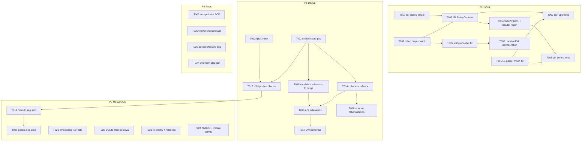

<!-- file: docs/plans/fable5-implementation-plan.md -->
<!-- version: 1.0.0 -->
<!-- guid: 1e4a7c2b-8f5d-4b9e-a6c3-9d2f5b8e1a4c -->

# Fable 5 Implementation Plan

Companion to:
- `docs/specs/fable5-review-findings.md` (finding IDs CRIT-*/HIGH-*/MED-*/LOW-*)
- `docs/specs/fable5-spec-itunes-writeback-hardening.md` (SPEC 2, ITW-* gap IDs)
- `docs/specs/fable5-spec-unified-dedup-pipeline.md` (SPEC 1)
- `docs/specs/fable5-spec-memory-db-optimization.md` (SPEC 3)

Coordination model: Fable 5 coordinates and reviews; Sonnet subagents execute one task
each in an isolated worktree, PR per task, rebase/FF merges, `make ci` (80% coverage)
gates every PR. Tasks marked **⚠ Fable-review-critical** change iTunes writers or PebbleDB
schemas and require line-by-line coordinator review before merge.

## Dependency graph

## Model assignments (authoritative — overrides per-task `Agent:` lines)

Match model to task character to control spend: Haiku for mechanical well-specified
changes, Sonnet for standard implementation/integration, Opus for the
irreversible-stakes iTunes writer internals. Fable 5 is coordinator/reviewer only and
implements nothing.

| Model | Tasks | Rationale |
|---|---|---|
| **haiku-4.5** | T009, T010, T018, T023, T025, T027 | S-effort, mechanical, fully specified steps; failure is cheap and caught by `make ci` |
| **sonnet-4.6** | T001, T002, T007, T008, T011, T012, T013, T014, T015, T016, T017, T019, T020, T021, T022, T024, T026 | standard implementation + integration work; ⚠-flagged ones (T012, T015, T019, T020, T022) get mandatory Fable line-review before merge |
| **opus-4.8** | T003, T004, T005, T006 | iTunes writer internals — binary-format correctness with irreversible production stakes; cheapest place to pay for the strongest model |

## Parallel execution groups

| Wave | Tasks (parallel within wave) | Notes |
|---|---|---|
| W1 | T001, T002, T009, T010, T011, T012, T023, T027 | all independent; no shared files |
| W2 | T003, T005, T013, T014, T015, T021, T022, T025, T026 | T003 needs T002+T010; T005 needs T002; serialize T005 after T003 ONLY if both touch `itl_le_mutate.go` in the same wave — prefer T003 first |
| W3 | T004, T006, T016, T018, T019 | T006 after T005 (same writer files) |
| W4 | T007, T008, T017, T020 | |
| W5 | T024 | big, last, optional |

Same-file serialization rules: `internal/itunes/itl_le_mutate.go` (T003→T005→T006);
`internal/dedup/engine.go` (T013→T014→T018); `internal/database/pebble_store.go`
(T012→T015→T019→T020). Frontend (T017) parallel with backend once T016's API contract
is merged. P2 (iTunes) is the highest-stakes track — its wave-1/2 tasks should start first.

---

### TASK-001: Fix LE parser to read track string metadata (mhoh descent)
Priority: P2 · Effort: M · Agent: sonnet-4.6 · Depends: []

**Context.** `walkMsdhTracksLE` (`internal/itunes/itl_le.go:49-91`) advances by each
`mith` chunk's totalLen, which includes its child `mhoh` blocks, so `parseMhohLE` is never
called for track metadata: every `ITLTrack` string field (Name, Album, Artist, Genre,
Kind, Location, LocalURL) is empty on LE libraries (findings HIGH-2; verified empirically
— `itl-diff -v` prints `"" by ""` for all tracks of a 94K-track library). All diagnostic
tooling and any service code reading these fields is blind. This fix is the prerequisite
for trustworthy diffs (T007) and diff-before-write (T008).

**Exact files to change**
- `internal/itunes/itl_le.go` — fix `walkMsdhTracksLE` (and confirm `walkMiahContent` has
  the same flaw): when tag == "mith", advance only `headerLen`, then walk children in
  `[offset+headerLen, offset+totalLen)` calling `parseMhohLE` on each mhoh; resume at
  `offset+totalLen`.
- `internal/itunes/itl_le_test.go` — new tests parsing a generated fixture and asserting
  Name/Album/Artist/Location populated.
- `cmd/itl-check/main.go` — no change needed; its Location counter starts working.

**Step-by-step**
1. Read `walkMsdhTracksLE` and `parseMithLE`; note `currentTrack` is set but mhoh case is
   unreachable when `length = totalLen` is used for mith.
2. Restructure: for mith, parse the mith header (`parseMithLE` with `headerLen`), append
   track, then inner-walk `[offset+headerLen, offset+min(totalLen, end-offset))` over
   mhoh chunks calling `parseMhohLE(data, o, l, currentTrack)`; advance outer offset by
   the same span the old code used (totalLen when valid) so chunk accounting is unchanged.
3. Apply the same restructuring inside `walkMiahContent`.
4. Use `generate_test_itls.go` helpers to build a small LE library with known
   names/locations; add `TestParseLE_TrackStrings` asserting all string fields round-trip.
5. Run existing tests: `go test ./internal/itunes/...` — `itl_le_test.go`,
   `itl_regression_test.go`, roundtrip tests must stay green (this is a read-path change;
   writers untouched).
6. Build `cmd/itl-check` and run against a generated fixture; assert "Tracks with
   Location" > 0 in an integration-style test if feasible.

**Acceptance criteria**
- [ ] `TestParseLE_TrackStrings` passes; Name/Album/Artist/Genre/Kind/Location/LocalURL populated.
- [ ] All pre-existing `internal/itunes` tests pass unmodified (`make test`).
- [ ] `make ci` green.

**Idempotency.** Done if `TestParseLE_TrackStrings` exists and passes. If interrupted:
the change is a single-function restructure; re-apply from scratch rather than resume.

**Rollback.** Revert the commit; read-path only, no data or format impact.

---

### TASK-002: Golden-corpus mhoh encoding audit tool + constants
Priority: P2 · Effort: M · Agent: sonnet-4.6 · Depends: []

**Context.** Forensics showed iTunes writes byte `+27` of every string mhoh as 0x00 and
uses `+24` as its encoding indicator (values 1/2/3 observed); our writer invents `+27 ∈
{1,3}` (CRIT-1). Before fixing writers (T005) and enforcing guards (T003) we need the
authoritative table of iTunes-authored byte patterns per hohm type, derived from a real
iTunes library, not invented. Note: the corpus source file is the operator's golden
library (provided at runtime; the `/tmp/itunes-libraries/` copies are ephemeral). The
tool must be re-runnable on any iTunes-authored `.itl`.

**Exact files to change**
- `cmd/itl-audit-encoding/main.go` — NEW: walks every mhoh in a library; emits per
  (hohmType): histogram of `+24` u32, `+27` byte, headerLen, whether string decodes as
  ASCII/UTF-16LE/UTF-8 given content heuristics; writes JSON report.
- `internal/itunes/mhoh_encoding_table.go` — NEW: `var ITunesMhohEncoding = map[uint32]…`
  constants checked in from the audit run, with provenance comment (library version
  12.13.10.3, date, counts).
- `internal/itunes/mhoh_encoding_table_test.go` — table sanity tests.

**Step-by-step**
1. Reuse `DecryptAndInflateITL` + the chunk-walk patterns from `itl_le_verify.go` to visit
   every mhoh in track, playlist, album, artist containers (msdh types 1, 2, 9, 11).
2. For each mhoh record: hohmType (+12), headerLen (+4), totalLen (+8), `+24` u32, `+27`
   byte, bytes 32–39 zero?, strDataLen (+28) arithmetic check.
3. Emit JSON: per hohmType → field histograms; flag any non-uniform headerLen.
4. Run against an operator-supplied iTunes-authored library (document the invocation in
   the tool's README section of main.go doc comment); capture output into the constants
   file. If no library is available at execution time, generate the constants file with
   the empirically-known invariants from SPEC 2 §1 (headerLen=24, +27=0, 32–39 zero) and
   leave `+24` per-type sets marked `TODO-corpus` — the guard consumes only populated entries.
5. Add tests: table is non-empty for hohm types 0x02, 0x0B, 0x0D; all entries have
   headerLen 24.
6. `make ci`.

**Acceptance criteria**
- [ ] `go run ./cmd/itl-audit-encoding <lib.itl>` produces a JSON histogram report.
- [ ] `internal/itunes/mhoh_encoding_table.go` exists with provenance comment.
- [ ] `make ci` green.

**Idempotency.** Done if the cmd and table file exist. Re-running the audit regenerates
the table deterministically from the same input.

**Rollback.** Delete the new files; nothing depends on them until T003/T005 merge.

---

### TASK-003: `ITLSafetyContract` — guard framework + guards ⚠ Fable-review-critical
Priority: P2 · Effort: L · Agent: sonnet-4.6 · Depends: [T002, T010]

**Context.** The only structural write-guard today is the dangling-mtph check, which
passes 3 of the 4 libraries iTunes rejected (HIGH-1). SPEC 2 §2 defines eight named
guards over (before, after, proposedHeader). This task builds the framework and all
guards except writer changes (T005/T006) — guards detect; they do not fix.

**Exact files to change**
- `internal/itunes/itl_safety_contract.go` — NEW: `GuardResult`, `Violation`,
  `ContractVerdict`, `RunSafetyContract(before, after []byte, hdr *hdfmHeader, cfg ContractConfig)`,
  plus guards: `parse-roundtrip`, `container-tiling`, `count-coherence`,
  `no-new-dangling-refs` (wraps existing verify, fail-closed), `mhoh-format`,
  `location-form`, `tid-pid-sanity`, `bounded-delta`. `AuditITL(data []byte)` single-library mode.
- `internal/itunes/itl_safety_contract_test.go` — NEW: full suite from SPEC 2 §6 table
  (12 corruption tests + clean-pass), mutation helpers test-local.
- `internal/itunes/itl_le_verify.go` — export small helpers if needed (no behavior change
  to existing functions in this task).

**Step-by-step**
1. Implement types exactly as SPEC 2 §2; guards are pure funcs
   `func(before, after []byte, hdr *hdfmHeader, cfg ContractConfig) GuardResult`.
2. `count-coherence`: read header BE fields at 0x44/0x48/0x4C/0x54 from the proposed
   header bytes; compare with payload mith/miph/miah/miih counts (walk per
   `itl_le_verify.go` patterns); also per-miph declared (+16) vs actual mtph children.
3. `mhoh-format`: enforce headerLen==24, totalLen==40+strLen, +27==0, bytes 32–39 zero,
   `+24` ∈ table from T002 when the table has entries for that hohmType.
4. `location-form` (per SPEC 2 §2, census-corrected): operate on **decoded** strings
   (0x0D can be UTF-16-encoded); per-track: if 0x0D present → matches `^[A-Za-z]:\\`,
   no `file://`, no `%`-escapes, and sibling 0x0B is a round-tripping
   `file://localhost/` URL; tracks without 0x0D (podcasts) may hold `http(s)://` in
   0x0B; no value contains `.itunes-writeback/`.
5. `parse-roundtrip`: must FAIL (not skip) when master list unlocatable or payload
   uninflatable — uses T010's fail-closed inflate.
6. `bounded-delta`: config defaults removedTracksMax=5000, rewrittenMhohPctMax=20, with
   `Force bool` override in cfg.
7. Write the regression tests per SPEC 2 §6 — base fixture from `generate_test_itls.go`;
   one focused mutation per test; assert the *named* guard fires and others stay silent.
8. `make ci`; coverage for the new file ≥ 80%.

**Acceptance criteria**
- [ ] All 13 SPEC-2 §6 contract tests pass; each guard individually triggerable.
- [ ] `AuditITL` on the clean generated fixture returns Pass.
- [ ] No existing writeback path behavior changed yet (contract not yet wired).
- [ ] `make ci` green.

**Idempotency.** Done if `itl_safety_contract.go` + its test file exist and pass. Guards
are additive; partial completion = missing guards, re-runnable per guard.

**Rollback.** Revert; nothing calls the contract until T004.

---

### TASK-004: `SafeWriteITL` atomic write + header regeneration ⚠ Fable-review-critical
Priority: P2 · Effort: L · Agent: sonnet-4.6 · Depends: [T003]

**Context.** Writes today go straight from mutation to `WriteITLBytes` with only the
dangling-ref check, and the stale `headerRemainder` is reused verbatim — the observed
CRIT-3 desync. SPEC 2 §3 defines the 8-step protocol (write `.itl.new`, contract on
in-memory AND re-read bytes, timestamped backup, atomic rename, retention 10 + lkg pin,
refuse BE, library-not-in-use precondition).

**Exact files to change**
- `internal/itunes/itl_safe_write.go` — NEW: `SafeWriteITL(path string, mutate func([]byte) ([]byte, error), opts ...SafeWriteOption) (*WriteReport, error)`;
  header regeneration (patch 0x44/0x48/0x4C/0x54 from payload counts, preserve all other
  remainder bytes); backup rotation + `.bak-lkg` pin handling.
- `internal/itunes/itl_combined_mutate.go` — route `ApplyITLOperationSet` (both paths,
  lines ~60 and ~137) through `SafeWriteITL`.
- `internal/itunes/itl.go` — `UpdateITLLocations`, `InsertITLTracks`,
  `RewriteITLExtensions`, `InsertITLPlaylist` refactored onto `SafeWriteITL`.
- `internal/itunes/rebuild.go` — rebuild write path onto `SafeWriteITL`.
- `internal/itunes/itl_safe_write_test.go` — NEW: rollback-on-violation,
  backup-rotation, header-regen (remove a track → header count updated), BE-refusal tests.

**Step-by-step**
1. Implement protocol steps 1–8 from SPEC 2 §3 exactly; `library-not-in-use` is an
   injected `func() error` option (the service wires its iTunes-running signal in T008;
   default = no-op with WARN log so cmd tools keep working).
2. Header regeneration: parse original `headerRemainder`; compute payload counts (reuse
   contract helpers); write BE u32s at remainder-relative offsets corresponding to file
   offsets 0x44/0x48/0x4C/0x54 (remainder starts after version string — compute from
   `parseHdfmHeader` layout, header file offset = 17 + len(version)).
3. fsync the `.itl.new` file and the directory after rename (`os.File.Sync`, open dir).
4. Backups: `<path>.bak-<RFC3339>`; rotation keeps 10 newest; `.bak-lkg` only via
   explicit `PinLastKnownGood(path)` API (service calls it after confirmed iTunes open).
5. Refactor each caller; keep their public signatures; delete now-redundant direct
   `WriteITLBytes` calls from those paths (keep the function — tools use it).
6. Tests per SPEC 2 §6 (`TestSafeWrite_RollbackOnViolation` asserts original
   byte-identical + no `.itl.new`残留; `TestSafeWrite_BackupRotation` 12 writes → 10 baks).
7. `make ci`.

**Acceptance criteria**
- [ ] All writeback entry points reach disk only via `SafeWriteITL` (grep: no other
      callers of `WriteITLBytes` outside cmd/ and itl_safe_write.go).
- [ ] Header counts correct after a removal round-trip test (regression for CRIT-3).
- [ ] Rollback + rotation + BE-refusal tests pass; `make ci` green.

**Idempotency.** Done if `itl_safe_write.go` exists and the grep criterion holds. Safe to
re-run callers refactor file-by-file.

**Rollback.** Revert commit. Backups created by the new path are inert files; no cleanup
needed beyond normal TTL.

---

### TASK-005: iTunes-conformant string encoders ⚠ Fable-review-critical
Priority: P2 · Effort: M · Agent: sonnet-4.6 · Depends: [T002, T003]

**Context.** CRIT-1: `encodeHohmString` (`internal/itunes/itl.go:373`) stamps +27 ∈ {1,3};
iTunes-authored blocks have +27 == 0 with the encoding indicator at +24. Writers
(`buildMhohLE` `itl_le_mutate.go:272`, `rewriteHohmLocationLE` `itl_le.go:656`, BE path
`itl_be.go:528`) must emit byte-for-byte iTunes-conformant headers per T002's table.

**Exact files to change**
- `internal/itunes/itl.go` — replace `encodeHohmString` with
  `encodeMhohITunes(hohmType uint32, s string) (payload []byte, hdr MhohHeaderBytes, err error)`
  driven by the T002 table; keep `decodeHohmString` reading BOTH legacy (+27) and iTunes
  (+24) conventions so previously-written libraries still parse.
- `internal/itunes/itl_le_mutate.go` — `buildMhohLE` uses the new encoder.
- `internal/itunes/itl_le.go` — `rewriteHohmLocationLE` uses it (and stops blind-copying
  +16..+27 from the original; sets the full header deterministically).
- `internal/itunes/itl_be.go` — BE writer: refuse with explicit error (per SPEC 2 K12)
  instead of adopting the LE table.
- tests: `itl_le_metadata_update_test.go` extensions — every written mhoh passes the
  T003 `mhoh-format` guard.

**Step-by-step**
1. From T002's table choose the canonical encoding per hohmType (expect: +24 patterns for
   ASCII vs UTF-16 variants; mirror exactly, including how iTunes encodes non-ASCII —
   verify with a non-ASCII fixture from the corpus report).
2. Implement `encodeMhohITunes`; error (never guess) for a hohmType absent from the table
   — callers fall back to preserving the original block unmodified + WARN, rather than
   writing an invented encoding.
3. Update the two LE writers; ensure UpdateMetadataLE's append path (`buildMhohLE`) and
   replace path (`rewriteHohmLocationLE`) produce identical bytes for identical input.
4. Make `decodeHohmString` dual-convention (+27 nonzero → legacy decode; else +24 table).
5. Property test: encode→parse round-trip equals input for ASCII, Latin-1, and CJK
   sample strings; every produced block passes `mhoh-format` guard.
6. `make ci`.

**Acceptance criteria**
- [ ] No writer emits +27 != 0 (guard-verified in tests).
- [ ] Round-trip property tests pass incl. non-ASCII.
- [ ] BE writeback returns explicit "BE writeback unsupported" error.
- [ ] `make ci` green.

**Idempotency.** Done if `encodeMhohITunes` exists and `encodeHohmString` has no remaining
writer callers (grep). 

**Rollback.** Revert; dual-convention reader means libraries written during the interim
remain parseable either way.

---

### TASK-006: `LocationPair` — 0x0B/0x0D normalization ⚠ Fable-review-critical
Priority: P2 · Effort: M · Agent: sonnet-4.6 · Depends: [T005]

**Context.** CRIT-2: 0x0D must hold a native Windows path, 0x0B the percent-escaped
`file://localhost/` URL; our writers pass through whatever callers provide (URLs observed
in 83,783 0x0D blocks of damaged-1/3, staging-dir paths in damaged-4). **The normative
field contract — including the podcast (no-0x0D) and UTF-16 edge cases — is SPEC 2 §1b;
implement exactly that, it is census-verified and not open to interpretation.**

**Exact files to change**
- `internal/itunes/location_pair.go` — NEW: `type LocationPair struct{ WinPath, URL string }`;
  constructors `LocationPairFromWinPath`, `LocationPairFromURL` (strict RFC-3986 escaping,
  drive-letter validation, rejection of `.itunes-writeback/` and relative paths).
- `internal/itunes/itl_le.go` — location update path (`rewriteChunksLEImpl` decision fn at
  ~:640) consumes a `LocationPair`; 0x0B gets `.URL`, 0x0D gets `.WinPath`.
- `internal/itunes/itl_le_metadata_update.go` — `ITLMetadataUpdate.Location` becomes the
  WinPath side; doc comment updated; `UpdateMetadataLE` derives the pair.
- `internal/itunes/service/writeback_batcher.go` — construct pairs from `f.ITunesPath`
  (detect form, normalize); reject unmappable values with per-item error, not write.
- `internal/itunes/service/track_provisioner.go`, `internal/itunes/service/importer.go` —
  same construction at the other ITLLocationUpdate sites (:467, :780, :827).
- tests: pair construction edge cases (spaces, `%` in filenames, UNC, non-ASCII), plus
  guard-passing assertion via T003 `location-form`.

**Step-by-step**
1. Implement `LocationPair` with bidirectional conversion (URL→path unescape + slash
   flip; path→URL escape) and validation errors.
2. Trace every writer call site (the five files above) and convert.
3. Where current data may already be URL-shaped in the DB (`f.ITunesPath`), normalize on
   read with a WARN metric — do not mutate the DB in this task.
4. Unit tests incl. round-trip property: `FromWinPath(p).URL` → `FromURL(url).WinPath == p`.
5. Integration test: full `ApplyITLOperationSet` with a location update on a generated
   fixture → contract passes, 0x0D contains backslash path.
6. `make ci`.

**Acceptance criteria**
- [ ] `location-form` guard passes on all writer outputs in tests.
- [ ] URL-in-0x0D regression test (write URL → rejected or normalized, never written raw).
- [ ] `make ci` green.

**Idempotency.** Done if `location_pair.go` exists and all five call sites construct pairs
(grep `NewLocation:`/`Location:` in the service files shows pair usage).

**Rollback.** Revert; previous behavior restored (with its known corruption risk).

---

### TASK-007: Diagnostic tool upgrades (itl-diff inventory + membership; itl-check audit)
Priority: P2 · Effort: M · Agent: sonnet-4.6 · Depends: [T001, T003]

**Context.** MED-5: `itl-diff` doesn't implement its documented msdh inventory and cannot
see playlist membership or mhoh-format problems; `itl-check` prints counts only. During
the corruption incident these tools reported "0 changed" on libraries with 167K rewritten
blocks. With T001 (real string parsing) and T003 (`AuditITL`) they can be made honest.

**Exact files to change**
- `cmd/itl-diff/main.go` — add msdh container inventory diff (type → totalLen), playlist
  membership diff (per-playlist added/removed TIDs), and `--audit` flag running `AuditITL`
  on both sides; string-field diffs now meaningful via T001.
- `cmd/itl-check/main.go` — run `AuditITL`, print verdict + per-guard violation counts;
  exit nonzero on violations.
- no test files for cmds required beyond `go vet`; core logic stays in `internal/itunes`
  (add any new diff helpers there WITH tests: `itl_diff_helpers.go` + `_test.go`).

**Step-by-step**
1. Move diffable walks (container inventory, playlist membership) into
   `internal/itunes/itl_diff_helpers.go` so they're testable.
2. Wire into both cmds; keep current flags working.
3. Fix the `itl-diff` docstring to match reality.
4. Tests: inventory + membership diff against two generated fixtures differing by one
   removed track and one playlist edit.
5. `make ci`.

**Acceptance criteria**
- [ ] `itl-check <fixture-with-violation>` exits nonzero naming the guard.
- [ ] `itl-diff` reports playlist membership delta on a fixture pair.
- [ ] `make ci` green.

**Idempotency.** Done if `itl-check` has an audit mode (`grep AuditITL cmd/itl-check`).

**Rollback.** Revert; tools-only change.

---

### TASK-008: Diff-before-write in writeback batcher
Priority: P2 · Effort: M · Agent: sonnet-4.6 · Depends: [T001, T004]

**Context.** HIGH-3: `writeback_batcher.go:346` pushes `ITLMetadataUpdate` for every
mapped file on every sync ("Always push metadata"), rewriting ~90K blocks per run —
maximal corruption blast radius and churn. With T001 the current ITL values are readable;
with T004 the write is contract-gated. Add change detection so only differing values are
written, and wire the `library-not-in-use` precondition.

**Exact files to change**
- `internal/itunes/service/writeback_batcher.go` — before building updates, parse the
  target library once; compare per-PID current Name/Album/Artist/Composer/Genre/Location
  with desired; emit updates only for changed fields; wire SafeWriteITL's
  library-not-in-use option to the existing sync-service iTunes-running signal.
- `internal/itunes/service/writeback_batcher_test.go` — no-change run produces zero
  updates; single-field change produces single update.

**Step-by-step**
1. Load + parse library (one `ParseITL`), index tracks by PID (strings now populated post-T001).
2. In the per-file loop, drop the unconditional append; compare desired vs current,
   field-by-field (trim/case-exact — iTunes values are authoritative bytes, compare exact).
3. Count skipped/changed in the operation log (repo logging discipline: start/progress/
   complete with counts).
4. Wire `WithLibraryNotInUse(check)` option from the service's running-state signal.
5. Tests with generated fixtures; include a Location compare via LocationPair (T006 not
   required — compare normalized forms via existing helpers if T006 unmerged; note
   ordering W4 puts this after T006 anyway).
6. `make ci`.

**Acceptance criteria**
- [ ] Sync against an in-sync fixture library performs zero mhoh rewrites (asserted via
      WriteReport counts).
- [ ] Changed-field test writes exactly one update.
- [ ] `make ci` green.

**Idempotency.** Done if the unconditional append is gone (grep "Always push metadata" →
absent) and tests exist.

**Rollback.** Revert to unconditional push (safe-but-churny behavior).

---

### TASK-009: accept-invite HTTP/2 EOF fix + request-size 413 clarity
Priority: P4 · Effort: S · Agent: sonnet-4.6 · Depends: []

**Context.** HIGH-4 (pen-test June 4 2026): `POST /api/v1/auth/accept-invite` returns
`{"error":"EOF"}` on empty/streamed HTTP/2 bodies — raw bind error passthrough at
`internal/server/auth_accept_invite.go:28`. MED-1: `middleware/request_size.go:52-58`
skips the early 413 when Content-Length is absent, surfacing MaxBytesReader truncation as
opaque EOF-ish errors.

**Exact files to change**
- `internal/server/auth_accept_invite.go` — map `io.EOF`/`io.ErrUnexpectedEOF`/empty-body
  bind errors to 400 `"request body required: token, password"`; never echo raw "EOF".
- `internal/server/middleware/request_size.go` — detect `http.MaxBytesError` after bind
  failures (or wrap body) → 413 with clear message; keep limits unchanged.
- tests: `auth_accept_invite_test.go` (empty body, no Content-Length body, oversized
  body), middleware test for chunked oversized body.

**Step-by-step**
1. Add a small helper in `internal/server/httputil` (or reuse) `BindJSONStrict(c, &req)`
   returning categorized errors; use it in accept-invite.
2. Assert response body never contains the bare string "EOF" (regression test).
3. Middleware: use `errors.As(err, &maxBytesErr)` to translate.
4. Reproduce the HTTP/2 shape with httptest (empty body + chunked) in tests.
5. `make ci`.

**Acceptance criteria**
- [ ] Empty-body POST returns 400 with actionable message, not "EOF" (test asserts).
- [ ] Oversized chunked body returns 413 (test asserts).
- [ ] `make ci` green.

**Idempotency.** Done if the regression tests exist and pass.

**Rollback.** Revert; error-shape-only change.

---

### TASK-010: Fail-closed inflate + verify (decompression cap)
Priority: P2 · Effort: S · Agent: sonnet-4.6 · Depends: []

**Context.** MED-7: `itlInflate` (`internal/itunes/itl.go:302-320`) silently returns the
*compressed* bytes as if uncompressed when the 512MB cap (or any read error) hits; the
golden library already inflates to 236MB. Downstream verifiers fail open when parse finds
no master list. Composition: oversized library → all guards pass on garbage.

**Exact files to change**
- `internal/itunes/itl.go` — `itlInflate` returns `([]byte, bool, error)`; cap exceeded or
  read error → error (callers updated: `parseITLData`, `DecryptAndInflateITL`,
  `ParseITLBytes`); raise cap to 2GB (config const) since legit payloads are ~236MB and
  growing.
- `internal/itunes/itl_test.go` — cap-exceeded fixture (small zlib bomb), assert explicit
  error not silent fallback.

**Step-by-step**
1. Change signature + thread error through the (few) callers; preserve the "not zlib at
   all" → `(data, false, nil)` legitimate pass-through for genuinely uncompressed payloads
   (first byte != 0x78).
2. Distinguish "not compressed" from "decompression failed" — only the former passes through.
3. Bomb test + happy-path tests.
4. `make ci`.

**Acceptance criteria**
- [ ] Decompression-bomb fixture yields an explicit error end-to-end from `ParseITL`.
- [ ] Existing parse tests green; `make ci` green.

**Idempotency.** Done if `itlInflate` returns an error value (signature check).

**Rollback.** Revert; restores silent-fallback behavior.

---

### TASK-011: `internal/dedup/unified` — Signal, UnifiedDedupScore, ComposeScore
Priority: P1 · Effort: M · Agent: sonnet-4.6 · Depends: []

**Context.** SPEC 1 §3–4. Pure scoring core: types, noisy-OR composition, banding,
config plumbing. No I/O, no engine changes — fully unit-testable foundation everything
else builds on.

**Exact files to change**
- `internal/dedup/unified/score.go` — NEW: types from SPEC 1 §3 verbatim.
- `internal/dedup/unified/compose.go` — NEW: `ComposeScore(signals []Signal, sup []string, cfg ScoreConfig) UnifiedDedupScore`
  implementing SPEC 1 §4 (noisy-OR over primaries, bounded supporting boosts, cap 100,
  banding, formula version `"noisy-or-v1"`).
- `internal/dedup/unified/config.go` — NEW: `ScoreConfig` with per-kind calibration,
  loaded from config.yaml `dedup.signals.*` with SPEC defaults; validation (confidences ∈
  (0,1], band thresholds ordered).
- `internal/config/` — register the new section (follow existing config registration pattern).
- `internal/dedup/unified/compose_test.go` — worked examples from SPEC 1 §4 as exact
  assertions; property tests (monotonicity: adding a primary signal never lowers score;
  cap respected; supporting-only sets never produce a candidate-eligible score ≥ 60).

**Step-by-step**
1. Copy type definitions from SPEC 1 §3 (they are normative).
2. Implement noisy-OR + boosts + cap + bands exactly per §4 incl. the three worked
   examples as test cases (100; 82; 98.7±0.1).
3. Supporting signals (`duration`, `folder_path`) excluded from the noisy-OR product —
   enforce via kind metadata, tested.
4. Config defaults table from SPEC 1 §3 comments; config.yaml override path + validation.
5. ≥90% coverage on the package (it's pure logic; cheap).
6. `make ci`.

**Acceptance criteria**
- [ ] Three worked-example tests pass with exact expected scores.
- [ ] Property tests pass; config validation rejects malformed calibration.
- [ ] `make ci` green.

**Idempotency.** Done if package exists with passing tests.

**Rollback.** Delete package; nothing references it until T013/T014/T015.

---

### TASK-012: LSH `fpidx:` PebbleDB index — build op + write/delete hooks ⚠ Fable-review-critical
Priority: P1 · Effort: L · Agent: sonnet-4.6 · Depends: []

**Context.** SPEC 1 §5. `fingerprint.Subprints()` exists (`lsh.go:69-147`); the index and
wiring do not. Key `fpidx:<subprint-hex16>:<bookfile_id>` → book_id; member list
`fpidx_member:<bookfile_id>` → JSON array of subprint hexes (for delete/update); versioned
completion flag `lsh_index_v1_done` per the established backfill pattern.

**Exact files to change**
- `internal/database/pebble_store_lsh.go` — NEW: `PutLSHEntries(fileID, bookID string, subprints []fingerprint.Subprint)`,
  `DeleteLSHEntries(fileID)`, `LSHProbe(subprints) map[fileID]bandHits` (point lookups),
  batch-based.
- `internal/database/pebble_store.go` — fingerprint write path (the BookFile update that
  sets `AcoustIDFingerprint`) calls Put/Delete hooks; BookFile delete calls DeleteLSHEntries.
- `internal/plugins/dedup/lsh_index_build.go` — NEW op `dedup.lsh-index-build`: iterate
  files with whole-file fingerprints, Subprints → PutLSHEntries, batches of 1,000,
  progress reporting, cancellable, sets `lsh_index_v1_done`.
- `internal/plugins/dedup/plugin.go` — register the op.
- `internal/server/handlers/dedup/handler.go` + `internal/server/wire_handlers.go` —
  `POST /api/v1/dedup/lsh-index` trigger.
- tests: store-level (put/probe/delete round-trip; member-list cleanup), op-level with
  mock store.

**Step-by-step**
1. Implement key codecs + batch writes; subprint hex = 16 lowercase hex chars of the
   8-byte subprint.
2. Hook the single fingerprint-set chokepoint (find it: grep `AcoustIDFingerprint =` in
   pebble store / file-update paths; if multiple, route through one helper first).
3. Build the op following an existing plugin op file as template (`embed_scan.go` shape:
   OperationDef, timeout 120m, ConcurrencyKey "dedup.lsh-index").
4. Probe: 64 point-gets per probe file; aggregate hits per candidate fileID; return ≥
   threshold only.
5. Wire HTTP trigger following existing dedup trigger handlers.
6. Tests; `make ci`.

**Acceptance criteria**
- [ ] Round-trip: index 3 fixture fingerprints, probe a near-duplicate → candidate with
      ≥2 band hits; probe unrelated → empty.
- [ ] Delete removes all `fpidx:` keys for a file (iterator-verified in test).
- [ ] Op is resumable (re-run continues; flag set at completion).
- [ ] `make ci` green.

**Idempotency.** Op itself idempotent (Put overwrites). Task done if
`pebble_store_lsh.go` + op registered + endpoint wired.

**Rollback.** Index keys are additive; delete by prefix `fpidx:`/`fpidx_member:` +
clear flag. No reader exists until T013.

---

### TASK-013: LSH probe collector; retire O(N) fuzzy scan
Priority: P1 · Effort: M · Agent: sonnet-4.6 · Depends: [T011, T012]

**Context.** SPEC 1 §5 probe path: subprints → fpidx point lookups → band-hit filter →
`WholeFileSimilarity` Hamming refine → `SigLSHAcoustID` signal. Replaces the disabled
`ACOUSTID_FUZZY_ENABLED` O(N) scan (`engine.go:30-46`).

**Exact files to change**
- `internal/dedup/collectors_acoustid.go` — NEW: exact-tier collector (wraps existing
  `book_file_acoustid:` lookup) + LSH collector emitting `Signal{Kind: SigLSHAcoustID,
  Raw: hamming, Confidence: scale(hamming)}`.
- `internal/dedup/engine.go` — remove `acoustidFuzzyEnabled` env gating + the O(N) scan
  path; engine calls collectors.
- tests: collector tests with fixture fingerprints (true positive, below-band-threshold
  negative, hamming-refine rejection).

**Step-by-step**
1. Implement collectors against the `LSHProbe` store API; gate LSH collector on
   `lsh_index_v1_done` flag (skip with INFO log when index unbuilt — never fall back to O(N)).
2. Confidence scaling per SPEC 1: hamming 0.85→conf 0.90 linear to 1.0→0.97 (config).
3. Delete the env-gated fuzzy path; grep `ACOUSTID_FUZZY_ENABLED` → zero hits.
4. Unit tests incl. flag-unset skip behavior.
5. `make ci`.

**Acceptance criteria**
- [ ] LSH collector returns calibrated signal for known-similar fixture pair.
- [ ] `ACOUSTID_FUZZY_ENABLED` no longer referenced anywhere.
- [ ] `make ci` green.

**Idempotency.** Done if collectors file exists and env var is gone.

**Rollback.** Revert; (the O(N) path returns but stays disabled-by-default as before).

---

### TASK-014: Collector refactor + PairEligibility + metadata-fuzzy collector
Priority: P1 · Effort: L · Agent: sonnet-4.6 · Depends: [T011]

**Context.** SPEC 1 §2: existing engine checks (`checkExactFileHash`,
`checkExactMetadataSourceHash`, embedding `findSimilarBooks`, duration gate at
`engine.go:578-691`, ISBN/ASIN via ext_id) become collectors emitting `Signal`s; the
negative guards (version-group, series-volume, same-dir: `engine.go:453-536,886-914`)
become a shared `PairEligibility` pre-filter. NEW metadata-fuzzy collector (normalized
title+author Levenshtein — the brief's METADATA_FUZZY tier; currently doesn't exist,
`GetDuplicateBooksByMetadata` is a stub).

**Exact files to change**
- `internal/dedup/eligibility.go` — NEW: `PairEligibility(a, b *Book) (ok bool, suppressors []string)`
  extracted from the three guard sites.
- `internal/dedup/collectors_exact.go`, `collectors_embedding.go`,
  `collectors_metadata.go` — NEW: wrap existing logic; metadata-fuzzy implements
  normalized-title/author similarity (reuse the Levenshtein already used by the duration
  gate) emitting `SigMetaFuzzy` with conf 0.70–0.85 scale.
- `internal/dedup/engine.go` — `CheckBook`/`FullScan` orchestrate: eligibility →
  collectors → `unified.ComposeScore` → persist (persistence schema in T015; until T015
  merges, scorer output maps onto existing `Layer`/`Similarity` fields — keep this task
  mergeable standalone).
- `internal/dedup/engine_test.go` + new collector tests — preserve every existing
  behavioral test; add eligibility extraction tests (same inputs → same drops as before).

**Step-by-step**
1. Extract guards verbatim into `PairEligibility` with table-driven tests proving
   identical decisions on the existing test corpus.
2. Wrap exact-hash, metadata-source-hash, embedding into collectors (logic unchanged —
   only the emission shape changes).
3. Convert the duration *gate* into a supporting `SigDuration` signal (±2% window from
   config; keep the `dedup:duration-match`/`duration-abridged` tagging side-effects).
4. Implement metadata-fuzzy collector (guarded by eligibility; candidate source =
   embedding top-K + LSH candidates only — never O(N²) title scan).
5. Orchestrate in `CheckBook`; compose score; persist via existing upsert.
6. Full engine test suite green + new tests; `make ci`.

**Acceptance criteria**
- [ ] All pre-existing dedup engine tests pass unmodified.
- [ ] Eligibility parity test passes (no behavior change in drops).
- [ ] A pair matched by embedding+duration produces a composed score with 2-signal breakdown.
- [ ] `make ci` green.

**Idempotency.** Done if collectors files exist and engine routes through ComposeScore.

**Rollback.** Revert; engine returns to per-layer writes.

---

### TASK-015: Candidate schema additions + legacy-fingerprint purge ⚠ Fable-review-critical
Priority: P1 · Effort: M · Agent: sonnet-4.6 · Depends: [T011]

**Context.** SPEC 1 §3 additive fields (`ScoreBreakdown`, `Band`, `FormulaVersion`) +
§8 migration; HIGH-5 purge of ~14K stale 100% candidates from pre-whole-file fingerprints.
PebbleDB candidate keys unchanged.

**Exact files to change**
- `internal/database/embedding_store.go` — extend `DedupCandidate` + `candRec` (additive
  JSON; absent = legacy); upsert stores breakdown; layer-precedence logic gains
  formula-version awareness (new-formula rows never downgraded by legacy writers).
- `internal/plugins/dedup/purge_legacy_fp.go` — NEW op `dedup.purge-legacy-fp-candidates`
  per SPEC 1 §8 step 2 (criteria: CreatedAt < whole-file cutover config date AND
  sim==1.0 AND layer ∈ {exact, embedding} AND no recomputable file-hash match → mark
  status `stale-fp`, not delete); versioned flag `dedup_fp_purge_v1_done`.
- `internal/plugins/dedup/plugin.go` — register; `wire_handlers.go` + dedup handler —
  trigger endpoint `POST /api/v1/dedup/purge-legacy-fp`.
- tests: round-trip new fields; purge criteria table-driven (keeps real exact-hash dupes,
  marks segment-era rows).

**Step-by-step**
1. Additive struct/JSON changes + round-trip test (old rows decode with empty new fields).
2. Implement purge op with dry-run mode (default) returning counts; `apply=true` param
   to execute; progress + final counts in operation log.
3. Re-score check inside purge: for each match candidate, recompute file-hash equality
   from current BookFiles before marking (no false purges).
4. Cutover date in config with documented default (the whole-file migration deploy date).
5. Wire endpoint; tests; `make ci`.

**Acceptance criteria**
- [ ] Old candidate rows parse unchanged (compat test).
- [ ] Dry-run on fixture set reports exactly the planted stale rows; apply marks them
      `stale-fp`; genuine hash-dupes untouched.
- [ ] `make ci` green.

**Idempotency.** Purge op re-runnable (marking is idempotent); flag set on completion.
Task done if struct fields + op + endpoint exist.

**Rollback.** Marked rows can be flipped back (`stale-fp` → `pending`) by an inverse query;
no deletions performed.

---

### TASK-016: Dedup API extensions
Priority: P1 · Effort: M · Agent: sonnet-4.6 · Depends: [T014, T015]

**Context.** SPEC 1 §6: extend `/dedup/candidates` (band/score/breakdown fields +
`band=`/`include_breakdown=` params), add `/dedup/candidates/:id/breakdown`,
`/dedup/rescore`, keep all existing endpoints stable. This freezes the API contract T017
builds against.

**Exact files to change**
- `internal/server/handlers/dedup/handler.go` — extend list response; new breakdown +
  rescore handlers.
- `internal/server/wire_handlers.go` — routes.
- `internal/dedup/engine.go` — `Rescore(ctx)` (ComposeScore over stored signal sets only).
- handler tests (mock store, follow `handlers/dedup` existing test pattern).

**Step-by-step**
1. Add fields/params to list handler (omit breakdown unless requested — payload size).
2. Breakdown endpoint: candidate + both books' comparison payload (covers/metadata/file
   info/audio-sample URLs — reuse existing book-detail serializers).
3. Rescore handler → engine method → per-band delta counts response.
4. OpenAPI/docs comment per repo api-doc conventions.
5. Tests for filters, omission behavior, 404s; `make ci`.

**Acceptance criteria**
- [ ] `GET /dedup/candidates?band=CERTAIN` filters correctly (test).
- [ ] Breakdown endpoint returns signals + both books in one response (test).
- [ ] Existing dedup API tests unchanged and green; `make ci` green.

**Idempotency.** Done if routes exist (`grep rescore wire_handlers.go`).

**Rollback.** Remove routes; additive only.

---

### TASK-017: Unified Dedup UI tab
Priority: P1 · Effort: L · Agent: sonnet-4.6 · Depends: [T016]

**Context.** SPEC 1 §7 component tree. Replaces Books/Advanced-Scan/Acoustic tabs with
one unified surface (those tabs remain mounted behind a "legacy" toggle for one release).
Feature-flagged default-off until backfill completes (repo rule).

**Exact files to change**
- `web/src/components/dedup/UnifiedDedupTab.tsx` + `ScoreBadgeRow.tsx`,
  `BandFilterBar.tsx`, `CandidateCompareDrawer.tsx`, `ScoreBreakdownPanel.tsx`,
  `FileInfoCompare.tsx`, `AudioSamplePair.tsx`, `BulkActionBar.tsx` — NEW per SPEC 1 §7.
- `web/src/pages/BookDedup.tsx` — tab wiring + legacy toggle + feature flag.
- `web/src/components/FingerprintVisualsColumn.tsx` — "compare in Dedup" deep-link.
- `web/src/api/` typed client additions for the new endpoints.
- Vitest tests per component (follow existing dedup component test patterns); one
  Playwright flow (open tab → filter band → open drawer → breakdown renders).

**Step-by-step**
1. Typed API client for extended candidates + breakdown + rescore.
2. Build table + band filter from `/dedup/stats` counts; MUI per existing pages.
3. Drawer with side-by-side compare; breakdown stacked-bar from signal contributions
   (compute shares client-side from Confidence list — same math as server, render only).
4. Bulk actions wrap existing merge/dismiss/cluster endpoints scoped by band; CERTAIN
   auto-merge requires a confirm dialog showing count.
5. Deep-link from FingerprintVisualsColumn (`/dedup?book=<id>` filter).
6. Memory-leak discipline per PR #1076 patterns (cleanup effects, AbortController).
7. `make test-all` + the Playwright flow in `make test-e2e`.

**Acceptance criteria**
- [ ] Vitest suites pass; Playwright unified-tab flow passes.
- [ ] Legacy tabs still reachable behind toggle.
- [ ] Feature flag default-off; `make ci` green.

**Idempotency.** Done if `UnifiedDedupTab.tsx` exists and is wired behind the flag.

**Rollback.** Flag off → old UI exactly as before.

---

### TASK-018: Scan operation rationalization
Priority: P1 · Effort: S · Agent: sonnet-4.6 · Depends: [T014]

**Context.** SPEC 1 §2 phases: merge `embed-scan`/`embed-async` into one op with async
flag; enforce phase ordering (hygiene → index → candidates) via concurrency keys; nightly
schedule wiring.

**Exact files to change**
- `internal/plugins/dedup/embed_scan.go` / `embed_async.go` — merge (keep both op IDs
  registered for one release, async one delegating, deprecation note in DisplayName).
- `internal/plugins/dedup/full_scan.go` — run purge-stale phase first (already does),
  then collectors pipeline; assert index flags before LSH-dependent phases.
- scheduler/config — nightly phase-2 entry following existing scheduled-op patterns.
- op tests updated.

**Step-by-step**
1. Merge ops; param `async bool`.
2. Phase-order assertions with clear skip logs.
3. Schedule config + docs.
4. Tests; `make ci`.

**Acceptance criteria**
- [ ] Both op IDs still triggerable; async delegates (test).
- [ ] full-scan skips LSH collector with logged reason when index flag unset (test).
- [ ] `make ci` green.

**Idempotency.** Done if `embed_async.go` delegates.

**Rollback.** Revert; ops were behavior-compatible throughout.

---

### TASK-019: Strip AcoustID segments from memdb ⚠ Fable-review-critical
Priority: P3 · Effort: S · Agent: sonnet-4.6 · Depends: [T013]

**Context.** SPEC 3 §6 item 1 — the headline RSS win (~550–900MB). `memdb_strip.go`
currently retains `AcoustIDSeg0–6` on BookFile rows solely for the now-deleted O(N) fuzzy
path; after T013, memdb has zero segment readers.

**Exact files to change**
- `internal/database/memdb_strip.go` — nil all Seg0–6 in `stripBookFileForMemdb`; update
  the sizing comments.
- `internal/database/memdb_warmup_test.go` / strip tests — assert segs nil post-strip.
- verify-no-readers step is part of the task, not assumed.

**Step-by-step**
1. `grep -rn "AcoustIDSeg" --include="*.go" internal/ | grep -v _test` — enumerate
   readers; confirm none read from memdb-sourced BookFiles (Pebble-direct readers like
   FingerprintVisualsColumn's API are unaffected — they read via GetBookFile).
2. Strip fields; adjust comments with new measured numbers.
3. Add a memdb-sourced-read regression test if a seam exists (skip if not feasible).
4. `make ci`; record before/after RSS from the memory-leak CI job if available.

**Acceptance criteria**
- [ ] Strip test asserts Seg0–6 nil in memdb rows.
- [ ] Reader audit results recorded in PR description (file:line list).
- [ ] `make ci` green.

**Idempotency.** Done if strip function nils Seg0–6.

**Rollback.** Revert one function; warmup repopulates on restart.

---

### TASK-020: Drop segment fields from `book_file:` Pebble values ⚠ Fable-review-critical
Priority: P3 · Effort: M · Agent: sonnet-4.6 · Depends: [T019]

**Context.** SPEC 3 §6 item 2: segments deprecated (`store.go:685-694`), LSH replaces the
last consumer; remove from stored values via lazy rewrite-on-touch + background sweep op,
flag `bookfile_seg_drop_v1_done`. Disk ~200–400MB + smaller deserialization on every file
read.

**Exact files to change**
- `internal/database/pebble_store.go` — BookFile marshal path omits Seg1–6 (json omitempty
  + explicit nil before write); keep struct fields (decode of old rows still works).
- `internal/plugins/dedup/bookfile_seg_sweep.go` — NEW sweep op: iterate `book_file:`,
  rewrite rows containing segments, batched, resumable, sets flag.
- registration + trigger endpoint + tests (old row decodes; rewritten row lacks segs;
  sweep resumable).

**Step-by-step**
1. Decide retention of Seg0 (derivable from whole-file via `DeriveSeg0`,
   `wholefile.go:100-116`) — drop it too; the deriver covers any legacy need.
2. Nil segs on every BookFile write (single marshal chokepoint).
3. Sweep op per the established backfill-op template; dry-run default with counts.
4. Tests; `make ci`.

**Acceptance criteria**
- [ ] Old-format row read test passes (compat).
- [ ] Sweep dry-run/apply counts correct on fixtures; flag set.
- [ ] `make ci` green.

**Idempotency.** Sweep resumable + re-runnable; flag versioned.

**Rollback.** Segments are derivable (Seg0) or re-computable via fingerprint rescan op;
rollback = stop sweep, revert marshal change. Document that already-rewritten rows lose
Seg1–6 until a rescan (acceptable: deprecated fields).

---

### TASK-021: Embedding float16 + zstd encoding
Priority: P3 · Effort: M · Agent: sonnet-4.6 · Depends: []

**Context.** SPEC 3 §3: `emb:v:` blobs are raw float32 (3072-dim, 12.3KB); target
float16+zstd (~3.5–4×, ~450MB disk saved), dual-read versioned by header byte, re-encode
op, flag `emb_f16_v1_done`.

**Exact files to change**
- `internal/database/embedding_store.go` — `encodeVector`/decode gain a 1-byte version
  header (v0 absent = legacy float32; v1 = f16+zstd); writes emit v1; reads accept both.
- `internal/plugins/dedup/emb_reencode.go` — NEW re-encode op (iterate `emb:v:`, rewrite,
  batched, resumable, flag).
- registration + endpoint + tests (round-trip cosine drift < 1e-3 on random vectors;
  dual-read compat; ratio assertion ≥3× on fixture corpus).

**Step-by-step**
1. f16 conversion (no new heavy dep — implement IEEE 754 half conversion locally or use
   `x/image/math` equivalent; zstd via existing dependency if present, else
   klauspost/compress — check go.mod first and prefer what's already there).
2. Version-byte framing; hydrate path (chromem) dequantizes to float32.
3. Cosine-drift property test (1K random vectors: |cos_f32 − cos_f16| < 1e-3).
4. Re-encode op; dry-run; flag.
5. `make ci`.

**Acceptance criteria**
- [ ] Dual-read test (v0 row decodes; v1 round-trips).
- [ ] Drift property test passes; compression ratio logged ≥3× on fixtures.
- [ ] `make ci` green.

**Idempotency.** Re-encode op resumable; rewriting v1 rows is a no-op.

**Rollback.** Dual-read retained → revert writer to v0; v1 rows remain readable.

---

### TASK-022: Remove legacy SQLite store
Priority: P3 · Effort: M · Agent: sonnet-4.6 · Depends: []

**Context.** MED-4 / SPEC 3 §2: ~7,938 lines `sqlite_store_*.go` + unconditional
`sql.Open("sqlite3")` at `database.go:20`; PebbleDB is the only production store. Remove
code, CGO dep, and the startup open.

**Exact files to change**
- `internal/database/database.go` — remove sql.Open + global `DB`.
- `internal/database/sqlite_store_*.go` — delete (after caller audit).
- `internal/database/web.go`, `cache_stats_history_store.go`, `ai_jobs_store.go`,
  `interface.go` — audit `database/sql` usage; migrate any live reader to Pebble
  equivalents or delete if dead.
- `go.mod` — drop `mattn/go-sqlite3` if no remaining importer.
- tests referencing the SQLite store — delete/port.

**Step-by-step**
1. Caller audit: `grep -rn "database/sql\|sqlite" --include="*.go" internal/ cmd/ | grep -v _test`
   — produce the live-path list in the PR description; anything reachable from server
   startup or any registered op must be ported, not deleted blind.
2. Confirm prod config cannot select SQLite (server startup reads PebbleDB path only).
3. Delete store files + startup open; port stragglers (expected: activity-log legacy
   reader → keep behind explicit migration cmd if it reads old prod `.db` files —
   verify with the owner via PR comment if found).
4. `go mod tidy`; build with and without `embed_frontend` tag.
5. `make ci` (full suite). 

**Acceptance criteria**
- [ ] No `mattn/go-sqlite3` in go.mod; no `sql.Open` in internal/.
- [ ] PR description contains the caller-audit table.
- [ ] `make ci` green; `make build` and `make build-api` succeed.

**Idempotency.** Done when grep criteria hold.

**Rollback.** Revert (pure code removal; no data touched — old `.db` files on prod are
left in place untouched either way).

---

### TASK-023: memdb telemetry, retention sweeps, dead-prefix hygiene
Priority: P3 · Effort: S · Agent: sonnet-4.6 · Depends: []

**Context.** SPEC 3 §5/§6 items 5–7: per-table memdb byte telemetry + soft regression
assert (≤4KB sampled stripped Book); `operation:`/`operationlog:` retention sweep;
one-off deletion sweep for dead `book:series:`/`book:author:` prefixes.

**Exact files to change**
- `internal/database/memdb_warmup.go` — post-warmup sampled size metrics → metrics store.
- `internal/database/memdb_strip_test.go` — sampled stripped-Book ≤4KB assert.
- maintenance loop (locate existing maintenance op) — operation retention (config days,
  default 90) + dead-prefix sweep guarded by flag `dead_prefix_sweep_v1_done`.
- tests for retention boundaries.

**Step-by-step**
1. Sampled sizing: marshal N=100 random rows per table, extrapolate, emit metric.
2. Soft assert test (fails CI if Book projection grows past 4KB sampled mean).
3. Retention sweep with dry-run + counts; wire into maintenance schedule.
4. Dead-prefix audit grep first (`book:series:`/`book:author:` readers must be zero),
   then sweep.
5. `make ci`.

**Acceptance criteria**
- [ ] Metrics emitted post-warmup (test with in-memory store).
- [ ] Retention test: rows older than cutoff removed, newer kept.
- [ ] `make ci` green.

**Idempotency.** Sweeps flag-guarded/re-runnable.

**Rollback.** Telemetry/sweeps are removable; retention deletions are intentional and
non-recoverable (operation logs only — acceptable, documented in PR).

---

### TASK-024: NutsDB → PebbleDB activity/metrics migration
Priority: P3 · Effort: L · Agent: sonnet-4.6 · Depends: [T023]

**Context.** SPEC 3 §4: remove the NutsDB engine. Key mapping is 1:1
(`act:<tier>:<nanokey>:<ulid>`, `met:<cache>:<nanokey>` as Pebble prefixes); must
re-implement TTL (metrics 30d) and digest compaction (`RecompactDigests`) on Pebble; the
activity Store interface already supports multiple backends — add a Pebble one, dual-write
window, backfill op, flag `activity_pebble_v1_done`, then retire NutsDB.

**Exact files to change**
- `internal/database/pebble_activity_store.go` + `pebble_metrics_store.go` — NEW backends
  implementing the existing activity/metrics interfaces (port from
  `nuts_activity_store.go`/`nuts_metrics_store.go` semantics incl. CompactByDay,
  RecompactDigests, op/book reverse indexes).
- backend selection/config + dual-write wrapper.
- backfill op (NutsDB → Pebble iteration) + flag.
- TTL sweep for metrics in maintenance.
- tests: parity suite run against both backends (table-driven over the interface).

**Step-by-step**
1. Port key layouts per SPEC 3 §4 table; lexicographic nano-keys preserved.
2. Interface parity tests first (run existing activity-store test suite against the new
   backend).
3. Dual-write wrapper (writes both, reads Pebble-after-flag/Nuts-before).
4. Backfill op, resumable, counts; flag at completion; flip reads.
5. One release later (separate follow-up, noted in TODO): remove NutsDB dep.
6. `make ci`.

**Acceptance criteria**
- [ ] Parity test suite green on Pebble backend incl. RecompactDigests behavior.
- [ ] Backfill op dry-run/apply counts correct on fixtures.
- [ ] Dual-write verified by test (entry lands in both).
- [ ] `make ci` green.

**Idempotency.** Backfill resumable (key-ordered cursor); dual-write idempotent.

**Rollback.** Flip reads back to NutsDB (dual-write means no data loss during the window).

---

### TASK-025: `FilterUnchangedTags` covers custom tags
Priority: P4 · Effort: S · Agent: sonnet-4.6 · Depends: []

**Context.** MED-3: `internal/metafetch/service_writeback.go:353-423` compares a fixed
field set; `AUDIOBOOK_ORGANIZER_*` custom tags fall through to always-write, defeating
skip detection and inflating `.bak-*` churn.

**Exact files to change**
- `internal/metafetch/service_writeback.go` — extend the comparison map with every custom
  tag field written by the tag writer (enumerate from the writer's full tag map builder —
  `buildFullTagMap` per project memory; verify name by grep).
- `internal/metafetch/service_writeback_test.go` — table-driven: unchanged custom tag
  skipped; changed custom tag written; unknown future key still defaults to write
  (preserve the safe default), with a WARN log so new fields get added consciously.

**Step-by-step**
1. Enumerate written tags (grep `AUDIOBOOK_ORGANIZER_` in metadata writer).
2. Extend comparisons reusing existing normalization helpers.
3. Keep unknown-key → write default; add WARN.
4. Tests; `make ci`.

**Acceptance criteria**
- [ ] No-change writeback on a fully-tagged fixture produces empty tag map (test).
- [ ] Changed custom tag still written (test); `make ci` green.

**Idempotency.** Done when tests exist.

**Rollback.** Revert; behavior returns to always-write (safe, churny).

---

### TASK-026: Duration/filesize aggregation from BookFiles
Priority: P4 · Effort: M · Agent: sonnet-4.6 · Depends: []

**Context.** MED-2 (and long-standing backlog): `Book.Duration`/`Book.FileSize`
(`store.go:128,170`) are import-time snapshots; multi-file books show wrong totals. Add
recompute-from-files at the file-mutation chokepoints + a backfill op.

**Exact files to change**
- `internal/database/pebble_store.go` — `RecomputeBookAggregates(bookID)` (sum
  BookFiles.Duration/FileSize where present); call from BookFile create/update/delete
  paths (single chokepoint preferred — locate the BookFile write helper).
- backfill op `library.recompute-aggregates` in the appropriate plugin (scanner or
  maintenance), flag `book_aggregates_v1_done`, dry-run default.
- tests: multi-file sum; single-file passthrough; missing-duration partial-sum rule
  (sum known, never zero out a populated snapshot with a less-complete sum — rule: write
  only if ≥ as many files have durations as before, else WARN).

**Step-by-step**
1. Implement recompute with the partial-data rule above (explicit, tested).
2. Hook file-write chokepoints; ensure `UpdateBook` full-replacement semantics respected
   (read-modify-write under the store's existing locking pattern).
3. Backfill op, resumable, counts, flag.
4. Tests incl. virtual-segment single-file books (`metafetch/service.go:365-376` path).
5. `make ci`.

**Acceptance criteria**
- [ ] 3-file fixture book shows summed duration/size after file update (test).
- [ ] Backfill dry-run counts correct; partial-data rule tests pass.
- [ ] `make ci` green.

**Idempotency.** Recompute idempotent; backfill flag-guarded.

**Rollback.** Snapshots aren't destroyed (sums overwrite only forward); disable hook +
re-run nothing — old values restorable from book_path_history only if needed (document:
practically forward-only, low risk).

---

### TASK-027: Chromem hydration shutdown join
Priority: P4 · Effort: S · Agent: sonnet-4.6 · Depends: []

**Context.** MED-8: hydration goroutine (`internal/dedup/lifecycle.go:103-112`) is
cancel-correct but not joined; `Stop()` can return while a Pebble read is in flight.

**Exact files to change**
- `internal/dedup/lifecycle.go` — add `bgWg sync.WaitGroup`; `Add(1)` before goroutine
  start (under `bgMu`), `defer Done()`; `Stop()` waits with a bounded timeout (5s) and
  WARNs on timeout.
- `internal/dedup/lifecycle_test.go` — Stop-during-hydration test (slow mock store):
  Stop returns only after goroutine exit; no panic on double-Stop.

**Step-by-step**
1. Add WaitGroup wiring exactly as the PR #1239 pattern extended with join.
2. Bounded wait in Stop (select on done-channel vs timer) — never hang shutdown.
3. Race test with `-race` (slow store mock).
4. `make ci`.

**Acceptance criteria**
- [ ] `-race` Stop-during-hydration test passes; double-Stop safe.
- [ ] `make ci` green.

**Idempotency.** Done if `bgWg` exists and Stop joins.

**Rollback.** Revert one file.

---

## Review gates for the coordinator (Fable 5)

Line-by-line review mandatory: T003, T004, T005, T006 (iTunes writers — irreversible
production stakes), T012, T015, T019, T020 (PebbleDB schema/data), T022 (mass deletion).
Standard review: all others. Every PR: `make ci` green + the task's acceptance criteria
checklist pasted and ticked in the PR description + COMPLETED/REMAINING/BLOCKED counts in
the final status comment.
