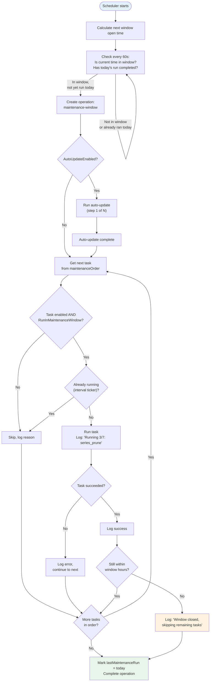

# Unified Maintenance Window

**Date:** 2026-03-12
**Status:** Approved

## Summary

Replace the separate auto-update window and per-task individual schedules with a single unified maintenance window. All maintenance tasks run sequentially in a defined order during this window, with auto-update always first. Interval-based tasks (iTunes sync, purge_deleted) remain on their own tickers.

## Motivation

The current system has 18 tasks with individual Enabled/Interval/OnStartup toggles. Maintenance tasks (dedup refresh, series prune, author split, db optimize, etc.) each have their own schedule, making it hard to reason about when things run and whether they'll interfere with each other. The auto-update window (`AutoUpdateWindowStart/End`) is separate from everything else.

The user wants a single maintenance window where cleanup tasks run in a smart order, with auto-update first so the server gets the latest code before doing maintenance work.

## Design

### Config Changes

**New fields:**

| Field | Type | Default | Description |
|-------|------|---------|-------------|
| `MaintenanceWindowEnabled` | bool | true | Master toggle for the window |
| `MaintenanceWindowStart` | int (0-23) | 1 | Hour the window opens |
| `MaintenanceWindowEnd` | int (0-23) | 4 | Hour the window closes |

**Deprecated fields (migrated on first load):**

| Old Field | Migrates To |
|-----------|-------------|
| `AutoUpdateWindowStart` | `MaintenanceWindowStart` |
| `AutoUpdateWindowEnd` | `MaintenanceWindowEnd` |

**Kept as-is:** `AutoUpdateEnabled`, `AutoUpdateChannel`, `AutoUpdateCheckMinutes` — these control *whether* auto-update runs, not *when*.

**Per-task new field:**

| Field Pattern | Type | Description |
|---------------|------|-------------|
| `MaintenanceWindow{TaskName}` | bool | Whether this task runs during the maintenance window |

Go struct: `MaintenanceWindowDedupRefresh`, etc. JSON/config key: `maintenance_window_dedup_refresh`, etc. Follows existing `Scheduled{Name}Enabled` naming convention.

Default `true` for: `dedup_refresh`, `series_prune`, `author_split_scan`, `tombstone_cleanup`, `reconcile_scan`, `purge_deleted`, `purge_old_logs`, `db_optimize`.

Default `false` for: `library_scan`, `library_organize`, `transcode`, `itunes_sync`, `itunes_import`, `ai_dedup_batch`, `metadata_refresh`, `resolve_production_authors`, `ai_pipeline_batch_poll`.

**Note:** `purge_deleted` defaults to maintenance window `true` AND keeps its 360min interval ticker. The maintenance window run is the primary mechanism; the interval ticker is a safety net. If the interval fires while the window is running (or vice versa), the duplicate-prevention logic skips it.

### Execution Order

When the maintenance window opens, tasks run sequentially in this fixed order:

| Order | Task | Rationale |
|-------|------|-----------|
| 1 | **auto-update** | Get latest code/fixes before anything else |
| 2 | **reconcile_scan** | Find missing/moved files before touching data |
| 3 | **dedup_refresh** | Refresh author & series dedup caches |
| 4 | **author_split_scan** | Split composite author names |
| 5 | **series_prune** | Merge duplicate series, delete orphans |
| 6 | **tombstone_cleanup** | Resolve author tombstone chains (A->B->C becomes A->C) |
| 7 | **purge_deleted** | Purge soft-deleted books past retention |
| 8 | **purge_old_logs** | Clean old operation logs |
| 9 | **db_optimize** | Compact ALL PebbleDB databases last, after cleanup |

Each task is skipped if:
- `RunInMaintenanceWindow` is false for that task, OR
- `IsEnabled()` returns false for that task

### db_optimize Enhancement

Currently `db_optimize` only compacts `GlobalStore` (main PebbleDB). The design expands it to compact all three PebbleDB databases:

1. **Main store** (`database.GlobalStore`) — books, authors, series, operations
2. **AI scan store** (`ai_scans.db`) — scan pipeline data
3. **OpenLibrary cache** — cached API responses

**Implementation:** Add `Optimize()` methods to `AIScanStore` and the OpenLibrary `OLStore` (both are PebbleDB, so `db.Compact(ctx, nil, []byte{0xff}, false)`). The `db_optimize` task handler in `scheduler.go` already has access to the `Server` struct, which holds references to these stores. The server initializes `s.aiScanStore` at startup (server.go:638) and the OL store via the metadata service. Add a `GlobalOLStore` reference (or pass through server) so the optimizer can reach it. If a store is nil (not initialized), skip it gracefully.

### Window Behavior

- **Startup:** Calculate next window open time. If we're currently inside the window, run immediately.
- **Trigger:** A single goroutine checks every minute if the current time is within the window and no run has happened today.
- **Execution:** Tasks run one at a time. A parent operation `maintenance-window` is created with sub-logs for each task.
- **Progress:** "Maintenance window: running task 3/7 (series_prune)"
- **Window close:** If the end time is reached mid-task, the current task finishes but remaining tasks are skipped. They run the next night.
- **Duplicate prevention:** If an interval task (e.g., purge_deleted) is already running when the window tries to run it, skip it.
- **Daily tracking:** The scheduler tracks `lastMaintenanceRun` date, **persisted to the database** as a setting (`maintenance_window_last_run`). Only one run per calendar day. This survives server restarts (including after auto-update).
- **Error handling:** Continue-on-error. If a task fails, log the error, record it in the parent operation, and proceed to the next task. A failed task does not prevent subsequent tasks from running. The overall window operation status is "completed_with_errors" if any task failed.
- **Auto-update restart:** If auto-update installs a new binary and restarts the server, the restarted process checks `lastMaintenanceRun` (persisted in DB). If today's date matches, it skips the window. Auto-update sets a `maintenance_window_update_completed` flag in the DB before triggering restart, so the post-restart window knows to skip step 1 and proceed directly to maintenance tasks.
- **Early window close:** If the window closes mid-run, `lastMaintenanceRun` is still set to today. Remaining tasks wait until next night. This is intentional — if a window is too short for all tasks, the admin should widen the window or reduce enabled tasks.
- **Timezone:** Window hours use the **server's local timezone** (consistent with existing `AutoUpdateWindowStart/End` behavior). This matches home-server use cases where "1am" means the admin's local 1am.
- **Midnight spanning:** Supported. If `Start > End` (e.g., start=23, end=2), the window spans midnight. The time-check logic treats this as "current hour >= start OR current hour < end".
- **Run entire window now:** A "Run Maintenance Now" button triggers the full window sequence immediately, regardless of time. Uses the same sequential logic but ignores the time-check.

### Scheduler Changes

The `TaskScheduler` struct gets:
- `maintenanceOrder []string` — fixed ordered list of task names for the window
- `lastMaintenanceRun time.Time` — tracks last successful window run date

New method: `RunMaintenanceWindow(ctx context.Context) error`
- Iterates through `maintenanceOrder`
- For each: checks enabled + window toggle, runs task, logs result
- Creates a single `maintenance-window` operation for the whole run

**Interval tasks are unaffected.** iTunes sync at 30min, purge_deleted at 360min, etc. continue on their own tickers regardless of the window.

### Frontend Changes

#### Maintenance Page

Each task bar gets a new toggle: **"Maint. Window"** (on/off), alongside the existing Enabled toggle.

For maintenance-window-eligible tasks:
```
[Task Name]                  Enabled ●  Maint. Window ●  [Active]  ▶ RUN NOW
dedup_refresh · Next: during maintenance (1:00 AM)
```

For interval-only tasks (iTunes sync, etc.), the bar stays as-is with the interval field. No "Maint. Window" toggle.

#### Settings Page (System tab)

New "Maintenance Window" section:
- Enabled toggle
- Start hour dropdown (0-23)
- End hour dropdown (0-23)
- Preview text: "Next window: Tonight at 1:00 AM" or "Window active now"

The existing "Auto Update" section keeps its Enabled/Channel fields but loses the window start/end fields (they're now part of the unified maintenance window).

### API Changes

**`GET /api/v1/tasks`** — `TaskInfo` gains a new field:
```json
{
  "run_in_maintenance_window": true
}
```

**`PUT /api/v1/tasks/:name`** — accepts new field:
```json
{
  "run_in_maintenance_window": true
}
```

**`GET /api/v1/config`** — returns new maintenance window fields.

**`PUT /api/v1/config`** — accepts new maintenance window fields.

### Migration

On first load after upgrade (idempotent — safe to run multiple times):
1. If `MaintenanceWindowStart` is not yet set AND `AutoUpdateWindowStart` exists, copy value
2. If `MaintenanceWindowEnd` is not yet set AND `AutoUpdateWindowEnd` exists, copy value
3. If `MaintenanceWindowEnabled` is not yet set, default to `true`
4. For each per-task field: if not yet set, apply category-based default
5. Mark migration complete via `maintenance_window_migrated = true` setting

## Files to Modify

### Backend
- `internal/config/config.go` — New config fields, migration logic
- `internal/server/scheduler.go` — Maintenance window runner, execution order, per-task toggle, db_optimize enhancement
- `internal/server/server.go` — Updated `listTasks`/`updateTaskConfig` handlers, config endpoints, "Run Maintenance Now" endpoint
- `internal/database/ai_scan_store.go` — Add `Optimize()` method (PebbleDB Compact)
- `internal/openlibrary/store.go` — Add `Optimize()` method (PebbleDB Compact)
- `internal/config/persistence.go` — Migration logic for old auto-update window fields

### Frontend
- `web/src/pages/Maintenance.tsx` — "Maint. Window" toggle, next-run display
- `web/src/pages/Settings.tsx` — Maintenance window config section
- `web/src/services/api.ts` — Updated task/config types

### Diagrams
- `docs/diagrams/component-diagram.mmd` — Add TaskScheduler/MaintenanceWindow to Services
- `docs/diagrams/flow-maintenance-window.mmd` — New diagram (see below)

## Diagrams

### Maintenance Window Flow


